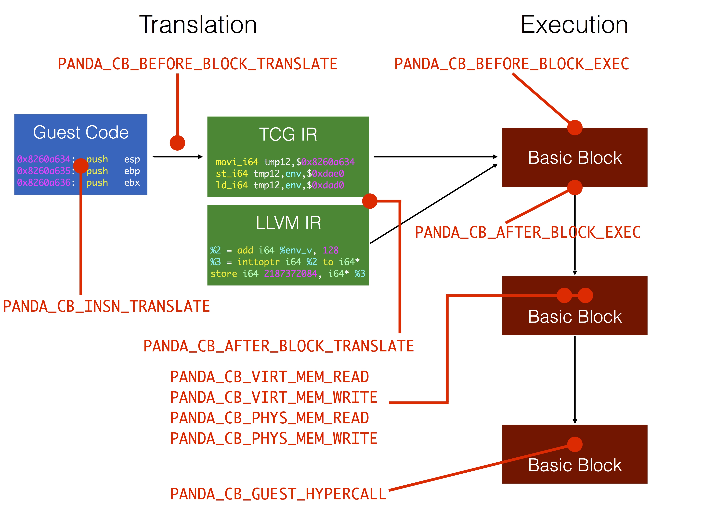

# PANDA User Manual

## Overview

PANDA (Platform for Architecture-Neutral Dynamic Analysis) is a whole-system
dynamic analysis engine based on QEMU 1.0.1. Its strengths lie in rapid reverse
engineering of software. PANDA includes a system for recording and replaying
execution, a framework for running LLVM analysis on executing code, and an
easily extensible plugin architecture. Together, these basic tools let you
rapidly understand how individual programs work and how they interact at the
system level.

## Quickstart

To build PANDA, use `panda_install.bash`, which installs all the dependencies
and builds PANDA. Don't worry; it won't actually install PANDA to a system
directory, despite the name. If you already have the dependencies you can just
run `qemu/build.sh`. Once it's built, you will find the QEMU binaries in
`i386-softmmu/qemu-system-i386`, `x86_64-softmmu/qemu-system-x86_64`, and
`arm-softmmu/qemu-system-arm`. You'll need to create a qcow (disk image) for use
with PANDA; the internet has documentation on how to do this.

We've found that the most effective workflow in PANDA is to collect a recording
of a piece of execution of interest and then analyze that recording over and
over again. You can read more about record/replay in [our
docs](record_replay.md). For now, what you need to know is that record/replay
allows you to repeat an execution trace with all data exactly the same over and
over again. You can then analyze the execution and slowly build understanding
about where things are stored, what processes are running, when the key
execution events happen, etc.

### Record

You can record execution by using the `begin_record` and `end_record` commands
in the QEMU monitor. To use the monitor, run QEMU with `-monitor stdio` (there
are [more complicated setups](https://en.wikibooks.org/wiki/QEMU/Monitor)
too). Type `begin_record "replay_name"` to start the recording process, and use
`end_record` to end it.

Recording will create two files: `replay_name-rr-snp`, the VM snapshot at
beginning of recording, and `replay_name-rr-nondet.log`, the log of all
nondeterministic inputs. You need both of those to reproduce the segment of
execution.

### Replay

You can replay a recording (those two files) using `qemu-system-$arch -replay
replay_name`. Make sure you pass the same memory size to the VM as you did for
the recording. Otherwise QEMU will fail with an incomprehensible error.

### Analysis

Once you've captured a replay, you should be able to play it over and over
again. We typically begin by using standard analyses to try and get a basic
picture of what's going on, followed by custom plugins to get more specific
analysis. Plugins reside in the [`panda_plugins`](../qemu/panda_plugins)
directory. Although the process depends on the example, some of the plugins we
often use to begin analysis are [`asidstory`](../qemu/panda_plugins/asidstory),
[`stringsearch`](../qemu/panda_plugins/stringsearch), and
[`file_taint`](../qemu/panda_plugins/file_taint).

## A Tour of Qemu

In order to use PANDA, you will need to understand at least some things about
the underlying emulator, QEMU.  In truth, the more you know about Qemu the
better, but that it is a complicated beast

### Qemu's Monitor

This is how you can access and control the emulator, to do all manner of things
including connecting an ISO to the CD drive and recording execution.  For full
details on what you do with the monitor, consult the Qemu manual.

The most common way of interacting with the monitor is just via `stdio` in the
terminal from which you originally entered the commandline that started up
Panda.  To get this to work, just add the following to the end of your
commandline: `--monitor stdio`.  There are also ways to connect to the monitor
over a telnet port etc -- refer to ethe Qemu manual for details.

Here are few monitor functions we commonly need with PANDA.

* Connect an ISO to the cd drive: `change ide1-cd0 foo.iso`.
* Begin/end recording: `begin_record foo` and `end_record`.

### Emulation details

Qemu emulates a large number of instruction set architectures, but only a few of
them are heavily used by PANDA reverse engineers.  In particular, PANDA support
is reasonably strong only for `x86`, `arm`, and `ppc`.

It is necessary to have a mental model of how Qemu emulates guest code in order
to write plugins.  Consider a basic block of guest code that Qemu wants to
emulate.  It disassembles that code into guest instructions, one by one,
simultaneously assembling a parallel basic block of instructions in an
intermediate language (IL).  This intermediate language is described in a
[README](https://github.com/moyix/panda/blob/master/qemu/tcg/README) if you are
interested.  From this IL, Qemu generates a corresponding basic block of binary
code that is directly executable on the host.  Note that it is from this Qemu IL
that PANDA generates LLVM instructions, as the two are fairly close already (our
LLVM translation is actually borrowed from the [S2E](http://s2e.epfl.ch/)
project). This basic block of code is actually executed, on the host, in order
to emulate guest behavior. Qemu toggles between translating guest code and
executing the translated binary versions. As a critical optimization, Qemu
maintains a cache of already translated basic blocks.

Here is how some of the plugins fit into that emulation sequence.

* `PANDA_CB_BEFORE_BLOCK_TRANSLATE` is before the initial translation of guest
  code. We don't know length of the block at this point.

* `PANDA_CB_AFTER_BLOCK_TRANSLATE` is after the translation of guest code. In this
  case we know how long the block is.

* `PANDA_CB_BEFORE_BLOCK_EXEC` is after the block of guest code has been
  translated into code that can run on the host and immediately before Qemu runs
  it.

* `PANDA_CB_AFTER_BLOCK_EXEC` is immediately after the block of translated guest
  code has actually been run on the host.

* `PANDA_CB_BEFORE_BLOCK_EXEC_INVALIDATE_OPT` is right after the guest code has
  been translated into code that can run on the host, but before it runs.  In
  some situations, plugin code determines that it is necessary to re-translate
  and can trigger that here, in particular in order to support LLVM lifting and
  taint.

* `PANDA_CB_INSN_TRANSLATE` is just before an instruction is translated, and
  allows inspection of the instruction to control how translation inserts other
  plugin callbacks such as the `INSN_EXEC` one.

* `PANDA_CB_INSN_EXEC` is just before host code emulating a guest instruction
  executes, but only exists if `INSN_TRANSLATE` callback returned true.

NOTE. Although it is a little out of date, the explanation of emulation in
Fabrice Bellard's original USENIX paper on Qemu is quite a good read.  "QEMU, a
Fast and Portable Dynamic Translator", USENIX 2005 Annual Technical Conference.

NOTE: Qemu has an additional cute optimization called `chaining` that links up
cached translated blocks of code in such a way that they emulation can
transition from one to another without the emulator being involved.  This is
enabled for record but currently turned off for replay in order to more easily
support callbacks before and after a basic block executes.

### What is `env`?

PANDA plugins need access to cpu registers and state. The Qemu abstract data
type for this `CPUState` and is accessed through a global pointer `env`.  Note
that the *actual* type for an emulated CPU is made more specific in the
`qemu/target-xxx/cpu.h` directory where `xxx` is the architecture in question.
For instance, in `qemu/target-i396/cpu.h, we find it redefined as `CPUX86State`,
where we also find convenient definitions such as `EAX`, `EBX`, and `EIP`.
Other information of interest such as hidden flags, segment registers, `idt`,
and `gdt` are all available via `env.

### Useful PANDA functions

These functions don't really form an API to Qemu or PANDA, but they are useful
for controlling PANDA or interacting with Qemu.

#### Qemu translation control

	void panda_do_flush_tb(void);
	
This function requests that the translation block cache be flushed as soon as
possible. If running with translation block chaining turned off (e.g. when in
LLVM mode or replay mode), this will happen when the current translation block
is done executing.

Flushing the translation block cache is additionally necessary if the plugin
makes changes to the way code is translated.  For example, by using
`panda_enable_precise_pc`.

**WARNING**: failing to flush the TB before turning on something that alters
code translation may cause QEMU to crash! This is because QEMU's interrupt
handling mechanism relies on translation being deterministic (see the
`search_pc` stuff in translate-all.c for details).

	void panda_disable_tb_chaining(void);
	void panda_enable_tb_chaining(void);

These functions allow plugins to selectively turn translation block chaining on
and off, regardless of whether the backend is TCG or LLVM, and independent of
record and replay.

#### Precise program counter

By default, QEMU does not update the program counter after every instruction.

	void panda_enable_precise_pc(void);
	void panda_disable_precise_pc(void);

These functions enable or disable precise tracking of the program counter.
After enabling precise PC tracking, the program counter will be available in
`env->panda_guest_pc` and can be assumed to accurately reflect the guest state.

Some plugins (`taint2`, `callstack_instr`, etc) add instrumentation that runs
*inside* a basic block of emulated code.  If such a plugin is enabled mid-replay
then it is important to flush the cache so that all subsequent guest code will
be properly instrumented. 

#### Memory access

Panda has callbacks for virtual and physical memory read and write, but these
are off by default due to overhead.
	
	void panda_enable_memcb(void);
	void panda_disable_memcb(void);

Use these two functions to enable and disable the memory callbacks. 

    int panda_physical_memory_rw(target_phys_addr_t addr, uint8_t *buf, int len, int is_write);

This function allows a plugin to read or write `len` bytes of guest physical
memory at `addr` into or from the supplied buffer `buf`. This function differs
from QEMU's `cpu_physical_memory_rw` in that it will never access I/O, only
RAM. This function returns zero on success, and negative values on failure (page not mapped).

    int panda_virtual_memory_rw(CPUState *env, target_ulong addr, uint8_t *buf, int len, int is_write);

This function is analogous to the previous one except that it uses the current
virtual to physical mapping (page tables) to permit read and write of guest
memory.  It has the same contract but the `addr` is a guest virtual address for
the current process.

#### LLVM control

    void panda_enable_llvm(void);
    void panda_disable_llvm(void);

These functions enable and disable the use of the LLVM JIT in replacement of the
TCG (Qemu intermediate language and compiler) backend.  Here, an additional
translation step is added from the TCG IR to the LLVM IR, and that is executed
on the LLVM JIT.  Currently, this only works when QEMU is starting up, but we
are hoping to support dynamic configuration of code generation soon.

#### Misellany

    void panda_memsavep(FILE *out);

Saves a physical memory snapshot into the open file pointer `out`. This function
is guaranteed not to perturb guest state.

    target_ulong panda_current_asid(CPUState *env);

Returns the current asid for a variety of architectures (`cr3` for x86, e.g.).

    bool panda_in_kernel(CPUState *env);

Returns true if the processor is in the privilege level corresponding to
executing kernel code for various architectures.

    void panda_disas(FILE *out, void *code, unsigned long size);

Writes a textual representation of disassembly of the guest code at virtual
address `code` of `size` bytes.

## Plugin Architecture

A great deal of the power of PANDA comes from its abiltiy to be extended with
plugins. Plugins allow you to register callback functions that will be executed
at various points as QEMU executes. Some of these callbacks and where they occur
in QEMU's execution are shown below:

### Callback List

`before_block_translate`: called before translation of each basic block

**Callback ID**: `PANDA_CB_BEFORE_BLOCK_TRANSLATE`

**Arguments**:

* `CPUState *env`: the current CPU state
* `target_ulong pc`: the guest PC we are about to translate

**Return value**:

unused

**Signature**:

	int (*before_block_translate)(CPUState *env, target_ulong pc);

---

`after_block_translate`: called after the translation of each basic block

**Callback ID**: `PANDA_CB_AFTER_BLOCK_TRANSLATE`

**Arguments**:

* `CPUState *env`: the current CPU state
* `TranslationBlock *tb`: the TB we just translated

**Return value**:

unused

**Signature**:

	int (*after_block_translate)(CPUState *env, TranslationBlock *tb);

---

`before_block_exec`: called before execution of every basic block

**Callback ID**: `PANDA_CB_BEFORE_BLOCK_EXEC`

**Arguments**:

* `CPUState *env`: the current CPU state
* `TranslationBlock *tb`: the TB we are about to execute

**Return value**:

unused

**Signature**:

    int (*before_block_exec)(CPUState *env, TranslationBlock *tb);

---

`before_block_exec_invalidate_opt`: called before execution of every basic
block, with the option to invalidate the TB

**Callback ID**: `PANDA_CB_BEFORE_BLOCK_EXEC_INVALIDATE_OPT`

**Arguments**:

* `CPUState *env`: the current CPU state
* `TranslationBlock *tb`: the TB we are about to execute

**Return value**:

`true` if we should invalidate the current translation block and retranslate, `false` otherwise

**Signature**:

    bool (*before_block_exec_invalidate_opt)(CPUState *env, TranslationBlock *tb);

---

`after_block_exec`: called after execution of every basic block

**Callback ID**: `PANDA_CB_AFTER_BLOCK_EXEC`

**Arguments**:

* `CPUState *env`: the current CPU state
* `TranslationBlock *tb`: the TB we just executed
* `TranslationBlock *next_tb`: the TB we will execute next (may be `NULL`)

**Return value**:

unused

**Signature:**:
 
    int (*after_block_exec)(CPUState *env, TranslationBlock *tb, TranslationBlock *next_tb);

---

`insn_translate`: called before the translation of each instruction

**Callback ID**: `PANDA_CB_INSN_TRANSLATE`

**Arguments**:

* `CPUState *env`: the current CPU state
* `target_ulong pc`: the guest PC we are about to translate

**Return value**:

`true` if PANDA should insert instrumentation into the generated code,
`false` otherwise

**Notes**:

This allows a plugin writer to instrument only a small number of
instructions, avoiding the performance hit of instrumenting everything.
If you do want to instrument every single instruction, just return
true. See the documentation for `PANDA_CB_INSN_EXEC` for more detail.

**Signature**:

	bool (*insn_translate)(CPUState *env, target_ulong pc);

---

`insn_exec`: called before execution of any instruction identified
by the `PANDA_CB_INSN_TRANSLATE` callback

**Callback ID**: `PANDA_CB_INSN_EXEC`

**Arguments**:

* `CPUState *env`: the current CPU state
* `target_ulong pc`: the guest PC we are about to execute

**Return value**:

unused

**Notes**:

This instrumentation is implemented by generating a call to a
helper function just before the instruction itself is generated.
This is fairly expensive, which is why it's only enabled via
the `PANDA_CB_INSN_TRANSLATE` callback.

**Signature**:

	int (*insn_exec)(CPUState *env, target_ulong pc);

---

`virt_mem_read`: called after memory is read

**Callback ID**: `PANDA_CB_VIRT_MEM_READ`

**Arguments**:

* `CPUState *env`: the current CPU state
* `target_ulong pc`: the guest PC doing the read
* `target_ulong addr`: the (virtual) address being read
* `target_ulong size`: the size of the read
* `void *buf`: pointer to the data that was read

**Return value**:

unused

**Notes**:

This callback is **deprecated** in favor of either
`PANDA_CB_VIRT_MEM_BEFORE_READ` or `PANDA_CB_VIRT_MEM_AFTER_READ`.

You must call `panda_enable_memcb()` to turn on memory callbacks
before this callback will take effect.

**Signature**:

	int (*virt_mem_read)(CPUState *env, target_ulong pc, target_ulong addr, target_ulong size, void *buf);

---

`virt_mem_write`: called before memory is written

**Callback ID**: `PANDA_CB_VIRT_MEM_WRITE`

**Arguments**:

* `CPUState *env`: the current CPU state
* `target_ulong pc`: the guest PC doing the write
* `target_ulong addr`: the (virtual) address being written
* `target_ulong size`: the size of the write
* `void *buf`: pointer to the data that is to be written 

**Return value**:

unused

**Notes**:

This callback is **deprecated** in favor of either
`PANDA_CB_VIRT_MEM_BEFORE_WRITE` or `PANDA_CB_VIRT_MEM_AFTER_WRITE`.

You must call `panda_enable_memcb()` to turn on memory callbacks
before this callback will take effect.

**Signature**:

	int (*virt_mem_write)(CPUState *env, target_ulong pc, target_ulong addr, target_ulong size, void *buf);

---

`phys_mem_read`: called after memory is read

**Callback ID**: `PANDA_CB_PHYS_MEM_READ`

**Arguments**:

* `CPUState *env`: the current CPU state
* `target_ulong pc`: the guest PC doing the read
* `target_ulong addr`: the (physical) address being read
* `target_ulong size`: the size of the read
* `void *buf`: pointer to the data that was read

**Return value**:

unused

**Notes**:

This callback is **deprecated** in favor of either
`PANDA_CB_PHYS_MEM_BEFORE_READ` or `PANDA_CB_PHYS_MEM_AFTER_READ`.

You must call `panda_enable_memcb()` to turn on memory callbacks
before this callback will take effect.

**Signature**:

	int (*phys_mem_read)(CPUState *env, target_ulong pc, target_ulong addr, target_ulong size, void *buf);

---

`phys_mem_write`: called before memory is written

**Callback ID**: `PANDA_CB_PHYS_MEM_WRITE`

**Arguments**:

* `CPUState *env`: the current CPU state
* `target_ulong pc`: the guest PC doing the write
* `target_ulong addr`: the (physical) address being written
* `target_ulong size`: the size of the write
* `void *buf`: pointer to the data that is to be written 

**Return value**:

unused

**Notes**:

This callback is **deprecated** in favor of either
`PANDA_CB_PHYS_MEM_BEFORE_READ` or `PANDA_CB_PHYS_MEM_AFTER_READ`.

You must call `panda_enable_memcb()` to turn on memory callbacks
before this callback will take effect.

**Signature**:

	int (*phys_mem_write)(CPUState *env, target_ulong pc, target_ulong addr, target_ulong size, void *buf);

---

`virt_mem_before_read`: called before memory is read

**Callback ID**: `PANDA_CB_VIRT_MEM_BEFORE_READ`

**Arguments**:

* `CPUState *env`: the current CPU state
* `target_ulong pc`: the guest PC doing the read
* `target_ulong addr`: the (virtual) address being read
* `target_ulong size`: the size of the read

**Return value**:

unused

**Notes**:

You must call `panda_enable_memcb()` to turn on memory callbacks
before this callback will take effect.

**Signature**:

    int (*virt_mem_before_read)(CPUState *env, target_ulong pc, target_ulong addr, target_ulong size);

---

`virt_mem_before_write`: called before memory is read

**Callback ID**: `PANDA_CB_VIRT_MEM_BEFORE_WRITE`

**Arguments**:

* `CPUState *env`: the current CPU state
* `target_ulong pc`: the guest PC doing the write
* `target_ulong addr`: the (virtual) address being written
* `target_ulong size`: the size of the write
* `void *buf`: pointer to the data that is to be written 

**Return value**:

unused

**Notes**:

You must call `panda_enable_memcb()` to turn on memory callbacks
before this callback will take effect.

**Signature**:

    int (*virt_mem_before_write)(CPUState *env, target_ulong pc, target_ulong addr, target_ulong size, void *buf);

---

`phys_mem_before_read`: called before memory is read

**Callback ID**: `PANDA_CB_PHYS_MEM_BEFORE_READ`

**Arguments**:

* `CPUState *env`: the current CPU state
* `target_ulong pc`: the guest PC doing the read
* `target_ulong addr`: the (physical) address being read
* `target_ulong size`: the size of the read

**Return value**:

unused

**Notes**:

You must call `panda_enable_memcb()` to turn on memory callbacks
before this callback will take effect.

**Signature**:

    int (*phys_mem_before_read)(CPUState *env, target_ulong pc, target_ulong addr, target_ulong size);

---

`phys_mem_before_write`: called before memory is written

**Callback ID**: `PANDA_CB_PHYS_MEM_BEFORE_WRITE`

**Arguments**:

* `CPUState *env`: the current CPU state
* `target_ulong pc`: the guest PC doing the write
* `target_ulong addr`: the (physical) address being written
* `target_ulong size`: the size of the write
* `void *buf`: pointer to the data that is to be written 

**Return value**:

unused

**Notes**:

You must call `panda_enable_memcb()` to turn on memory callbacks
before this callback will take effect.

**Signature**:

    int (*phys_mem_before_write)(CPUState *env, target_ulong pc, target_ulong addr, target_ulong size, void *buf);

---

`virt_mem_after_read`: called after memory is read

**Callback ID**: `PANDA_CB_VIRT_MEM_AFTER_READ`

**Arguments**:

* `CPUState *env`: the current CPU state
* `target_ulong pc`: the guest PC doing the read
* `target_ulong addr`: the (virtual) address being read
* `target_ulong size`: the size of the read
* `void *buf`: pointer to data just read

**Return value**:

unused

**Notes**:

You must call `panda_enable_memcb()` to turn on memory callbacks
before this callback will take effect.

**Signature**:

    int (*virt_mem_after_read)(CPUState *env, target_ulong pc, target_ulong addr, target_ulong size, void *buf);

---

`virt_mem_after_write`: called after memory is written

**Callback ID**: `PANDA_CB_VIRT_MEM_AFTER_WRITE`

**Arguments**:

* `CPUState *env`: the current CPU state
* `target_ulong pc`: the guest PC doing the write
* `target_ulong addr`: the (virtual) address being written
* `target_ulong size`: the size of the write
* `void *buf`: pointer to the data that was written 

**Return value**:

unused

**Notes**:

You must call `panda_enable_memcb()` to turn on memory callbacks
before this callback will take effect.

**Signature**:

    int (*virt_mem_after_write)(CPUState *env, target_ulong pc, target_ulong addr, target_ulong size, void *buf);

---

`phys_mem_after_read`: called after memory is read

**Callback ID**: `PANDA_CB_PHYS_MEM_AFTER_READ`

**Arguments**:

* `CPUState *env`: the current CPU state
* `target_ulong pc`: the guest PC doing the write
* `target_ulong addr`: the (physical) address being written
* `target_ulong size`: the size of the write
* `void *buf`: pointer to the data that was written 

**Return value**:

unused

**Notes**:

You must call `panda_enable_memcb()` to turn on memory callbacks
before this callback will take effect.

**Signature**:

    int (*phys_mem_after_read)(CPUState *env, target_ulong pc, target_ulong addr, target_ulong size, void *buf);

---

`phys_mem_after_write`: called after memory is written

**Callback ID**: `PANDA_CB_PHYS_MEM_AFTER_WRITE`

**Arguments**:

* `CPUState *env`: the current CPU state
* `target_ulong pc`: the guest PC doing the write
* `target_ulong addr`: the (physical) address being written
* `target_ulong size`: the size of the write
* `void *buf`: pointer to the data that was written 

**Return value**:

unused

**Notes**:

You must call `panda_enable_memcb()` to turn on memory callbacks
before this callback will take effect.

**Signature**:

    int (*phys_mem_after_write)(CPUState *env, target_ulong pc, target_ulong addr, target_ulong size, void *buf);

---

`guest_hypercall`: called when a program inside the guest makes a
hypercall to pass information from inside the guest to a plugin

**Callback ID**: `PANDA_CB_GUEST_HYPERCALL`

**Arguments**:

* `CPUState *env`: the current CPU state

**Return value**:

unused

**Notes**:

On x86, this is called whenever CPUID is executed. Plugins then check for magic
values in the registers to determine if it really is a guest hypercall.
Parameters can be passed in other registers.  We have modified translate.c to
make CPUID instructions end translation blocks.  This is useful, if, for
example, you want to have a hypercall that turns on LLVM and enables heavyweight
instrumentation at a specific point in execution.

S2E accomplishes this by using a (currently) undefined opcode. We
have instead opted to use an existing instruction to make development
easier (we can use inline asm rather than defining the raw bytes).

AMD's SVM and Intel's VT define hypercalls, but they are privileged
instructions, meaning the guest must be in ring 0 to execute them.

For hypercalls in ARM, we use the MCR instruction (move to coprocessor from ARM
register), moving to coprocessor 7.  CP 7 is reserved by ARM, and isn't
implemented in QEMU.  The MCR instruction is present in all versions of ARM, and
it is an unprivileged instruction in this scenario.  Plugins can also check for
magic values in registers on ARM.

**Signature**:

	int (*guest_hypercall)(CPUState *env);

---

**monitor**: called when someone uses the `plugin_cmd` monitor command

**Callback ID**: `PANDA_CB_MONITOR`

**Arguments**:

* `Monitor *mon`: a pointer to the Monitor
* `const char *cmd`: the command string passed to plugin_cmd

**Return value**:

unused

**Notes**:

The command is passed as a single string. No parsing is performed
on the string before it is passed to the plugin, so each plugin
must parse the string as it deems appropriate (e.g. by using `strtok`
and `getopt`) to do more complex option processing.

It is recommended that each plugin implementing this callback respond
to the "help" message by listing the commands supported by the plugin.

Note that every loaded plugin will have the opportunity to respond to
each `plugin_cmd`; thus it is a good idea to ensure that your plugin's
monitor commands are uniquely named, e.g. by using the plugin name
as a prefix (`sample_do_foo` rather than `do_foo`).

**Signature**:

	int (*monitor)(Monitor *mon, const char *cmd);

---

`cb_cpu_restore_state`: Called inside of cpu_restore_state(), when there is a
CPU fault/exception

**Callback ID**: `PANDA_CB_CPU_RESTORE_STATE`

**Arguments**:

* `CPUState *env`: the current CPU state
* `TranslationBlock *tb`: the current translation block

**Return value**: unused

**Signature**:

    int (*cb_cpu_restore_state)(CPUState *env, TranslationBlock *tb);

---

`before_loadvm`: called at the start of replay, just before the snapshot state
is loaded

**Callback ID**: `PANDA_CB_BEFORE_REPLAY_LOADVM`

**Arguments**:

None.

**Return value**:

unused

**Notes**:

This allows us to hook devices' loadvm handlers (remember to unregister the
existing handler for the device first)

An example of how to use this callback can be found in the `sample` plugin.

**Signature**

    int (*before_loadvm)(void);

---

`user_before_syscall`: Called before a syscall for QEMU user mode.

**Callback ID**: `PANDA_CB_USER_BEFORE_SYSCALL`

**Arguments**:

* `void *cpu_env`: pointer to CPUState
* `bitmask_transtbl *fcntl_flags_tbl`: syscall flags table from syscall.c
* `int num`: syscall number
* `abi_long arg1..arg8`: syscall arguments

**Return value**: unused

**Notes**:
Some system call arguments need some additional processing, as evident in
linux-user/syscall.c.  If your plugin is particularly interested in system call
arguments, be sure to process them in similar ways.

Additionally, this callback is dependent on running qemu in linux-user mode,
a mode for which PANDA support is being phased out. To use this callback you
will need to wrap the code in #ifdefs. See the 'taint' or 'llvm_trace' PANDA 
plugins for examples of legacy usage. This callback will likely be removed in 
future versions of PANDA.

**Signature**:

    int (*user_before_syscall)(void *cpu_env, bitmask_transtbl *fcntl_flags_tbl,
                               int num, abi_long arg1, abi_long arg2, abi_long
                               arg3, abi_long arg4, abi_long arg5,
                               abi_long arg6, abi_long arg7, abi_long arg8);

---

`user_after_syscall`: Called after a syscall for QEMU user mode

**Callback ID**: `PANDA_CB_USER_AFTER_SYSCALL`

**Arguments**:

* `void *cpu_env`: pointer to CPUState
* `bitmask_transtbl *fcntl_flags_tbl`: syscall flags table from syscall.c
* `int num`: syscall number
* `abi_long arg1..arg8`: syscall arguments
* `void *p`: void pointer used for processing of some arguments
* `abi_long ret`: return value of syscall

**Return value**: unused

**Notes**:

Some system call arguments need some additional processing, as evident in
linux-user/syscall.c.  If your plugin is particularly interested in system call
arguments, be sure to process them in similar ways.

Additionally, this callback is dependent on running qemu in linux-user mode,
a mode for which PANDA support is being phased out. To use this callback you
will need to wrap the code in #ifdefs. See the 'taint' or 'llvm_trace' PANDA 
plugins for examples of legacy usage. This callback will likely be removed in 
future versions of PANDA.

**Signature**:

    int (*user_after_syscall)(void *cpu_env, bitmask_transtbl *fcntl_flags_tbl,
                              int num, abi_long arg1, abi_long arg2, abi_long
                              arg3, abi_long arg4, abi_long arg5, abi_long arg6,
                              abi_long arg7, abi_long arg8, void *p,
                              abi_long ret);

---

`after_PGD_write`: called when the CPU changes to a different address space

**Callback ID**: `PANDA_CB_VMI_PGD_CHANGED`

**Arguments**:

* `CPUState* env`: pointer to CPUState
* `target_ulong oldval`: old PGD (address space identifier) value
* `target_ulong newval`: new PGD (address space identifier) value

**Return value**:

unused

**Signature**:

    int (*after_PGD_write)(CPUState *env, target_ulong oldval, target_ulong newval);

---

`replay_hd_transfer`: Called during a replay of a hard drive transfer action

**Callback ID**: `PANDA_CB_REPLAY_HD_TRANSFER` 
 
**Arguments**:

* `CPUState* env`: pointer to CPUState
* `uint32_t type`: type of transfer (Hd_transfer_type)
* `uint64_t src_addr`: address for src
* `uint64_t dest_addr`: address for dest
* `uint32_t num_bytes`: size of transfer in bytes

**Return value**: unused

**Notes**:

In replay only, some kind of data transfer involving hard drive.  NB: We are
neither before nor after, really.  In replay the transfer doesn't really happen.
We are *at* the point at which it happened, really.  Even though the transfer
doesn't happen in replay, useful instrumentations (such as taint analysis) can
still be applied accurately.

The allowed values for type are:

* `HD_TRANSFER_HD_TO_IOB`
* `HD_TRANSFER_IOB_TO_HD`
* `HD_TRANSFER_PORT_TO_IOB`
* `HD_TRANSFER_IOB_TO_PORT`
* `HD_TRANSFER_HD_TO_RAM`
* `HD_TRANSFER_RAM_TO_HD`

**Signature**:

    int (*replay_hd_transfer)(CPUState *env, uint32_t type, uint64_t src_addr,
                              uint64_t dest_addr, uint32_t num_bytes);

---

`replay_net_transfer`: Called during a replay of a network transfer action

**Callback ID**: `PANDA_CB_REPLAY_NET_TRANSFER` 
 
**Arguments**:

        CPUState* env:        pointer to CPUState
        uint32_t type:        type of transfer  (Net_transfer_type)
        uint64_t src_addr:    address for src
        uint64_t dest_addr:   address for dest
        uint32_t num_bytes:   size of transfer in bytes

**Return value**: unused

**Notes**:

In replay only, some kind of data transfer within the network card (currently,
only the E1000 is supported). NB: We are neither before nor after, really. In
replay the transfer doesn't really happen.  We are *at* the point at which it
happened, really.

**Signature**:

    int (*replay_net_transfer)(CPUState *env, uint32_t type, uint64_t src_addr,
                               uint64_t dest_addr, uint32_t num_bytes);

---

`replay_before_cpu_physical_mem_rw_ram`: In replay only, we are about to dma
from some qemu buffer to guest memory

**Callback ID**: `PANDA_CB_REPLAY_BEFORE_CPU_PHYSICAL_MEM_RW_RAM`

**Arguments**:

* `CPUState* env`: pointer to CPUState
* `uint32_t is_write`: type of transfer going on (is_write == 1 means IO -> RAM else RAM -> IO)
* `uint64_t src_addr`: src of dma
* `uint64_t dest_addr`: dest of dma
* `uint32_t num_bytes`: size of transfer

**Return value**: unused

**Notes**:
In the current version of QEMU, this appears to be a less commonly used method
of performing DMA with the hard drive device.  For the hard drive, the most
common DMA mechanism can be seen in the `PANDA_CB_REPLAY_HD_TRANSFER_TYPE` under
type `HD_TRANSFER_HD_TO_RAM` (and vice versa). Other devices still appear to use
cpu_physical_memory_rw() though.

**Signature**:

    int (*replay_before_cpu_physical_mem_rw_ram)(
            CPUState *env, uint32_t is_write, uint64_t src_addr, uint64_t dest_addr,
            uint32_t num_bytes);

---

`replay_after_cpu_physical_mem_rw_ram`: In replay only, we have just done a DMA
from some QEMU buffer to guest memory

**Callback ID**: `PANDA_CB_REPLAY_AFTER_CPU_PHYSICAL_MEM_RW_RAM`

**Arguments**:

* `CPUState* env`: pointer to CPUState
* `uint32_t is_write`: type of transfer going on (is_write == 1 means IO -> RAM else RAM -> IO)
* `uint64_t src_addr`: src of DMA
* `uint64_t dest_addr`: dest of DMA
* `uint32_t num_bytes`: size of transfer

**Return value**: unused

**Notes**:

In the current version of QEMU, this appears to be a less commonly used method
of performing DMA with the hard drive device.  For the hard drive, the most
common DMA mechanism can be seen in the PANDA_CB_REPLAY_HD_TRANSFER_TYPE under
type HD_TRANSFER_HD_TO_RAM (and vice versa).  Other devices still appear to use
cpu_physical_memory_rw() though.

**Signature**:

    int (*replay_after_cpu_physical_mem_rw_ram)(
            CPUState *env, uint32_t is_write, uint8_t* src_addr, uint64_t dest_addr,
            uint32_t num_bytes);

---

`replay_handle_packet`: used for network packet replay

**Callback ID**: `PANDA_CB_REPLAY_HANDLE_PACKET`

**Arguments**:

* `CPUState *env`: pointer to CPUState
* `uint8_t *buf`: buffer containing packet data
* `int size`: num bytes in buffer
* `uint8_t direction`: `PANDA_NET_RX` for receive, `PANDA_NET_TX` for transmit
* `uint64_t old_buf_addr`: the address that `buf` had when the recording was
  taken

**Return value**:

unused

**Signature**:

    int (*replay_handle_packet)(CPUState *env, uint8_t *buf, int size,
                                uint8_t direction, uint64_t old_buf_addr);

### Order of execution

If you're using multiple plugins that work together to perform some analysis,
you may care about what order plugins' callbacks execute in, since some
operations may not make sense if they're done out of order.

The bad news is that PANDA does not guarantee any fixed ordering for its
callbacks. In the current implementation, each callback of a given type will be
executed in the order it was registered (which is usually the order in which the
plugins were loaded; however, because callbacks can be registered at any time
throughout a plugin's lifetime, even this is not guaranteed). This could change
in the future, though, and in general it's not a good idea to rely on it.

The good news is that there's a better way to enforce an ordering. As described
in the next section, plugins support explicit mechanisms for interacting with
each other. In particular, you can create plugin callbacks, which allow a
plugins to notify each other when certain events inside the plugin occur. For
example, if you wanted to ensure that something in Plugin B always happens after
Plugin A does some action `foo`, Plugin A would create an `on_foo` callback that
Plugin B could then register with. This is much safer and more robust than
trying to guess the order in which the plugin callbacks will be called.

The next section describes this mechanism in more detail.

### Plugin-plugin interaction

It's often very handy to be able to allow plugins to interact with one another.
For example, the `taint2` plugin accesses

#### Plugin callbacks

#### Plugin API

## Plugin Zoo

We have written a bunch of generic plugins for use in analyzing replays. Each
one has a USAGE.md file linked here for further explanation.

### Taint-related plugins
* [`taint2`](../qemu/panda_plugins/taint2/USAGE.md) - Modern taint plugin.
  Required by most other taint plugins.
* [`dead_data`](../qemu/panda_plugins/dead_data/USAGE.md) - Track dead data
  (tainted, but not used in branches).
* [`ida_taint2`](../qemu/panda_plugins/ida_taint2/USAGE.md) - IDA taint
  integration.
* [`file_taint`](../qemu/panda_plugins/file_taint/USAGE.md) - Syscall and
  OSI-based automatic tainting of file input by filename.
* [`tainted_branch`](../qemu/panda_plugins/tainted_branch/USAGE.md) - Find
  conditional branches where the choice depends on tainted data.
* [`tainted_instr`](../qemu/panda_plugins/tainted_instr/USAGE.md) - Find
  instructions which process tainted data.
* [`taint_compute_numbers`](../qemu/panda_plugins/taint_compute_numbers/USAGE.md)
  \- Analyze taint compute numbers (computation tree depth) for tainted data.
* [`tstringsearch`](../qemu/panda_plugins/tstringsearch/USAGE.md) - Automatically
  taint all occurrences of a certain string.

#### Old generation
* [`taint`](../qemu/panda_plugins/taint/USAGE.md) - Old taint plugin.
* [`ida_taint`](../qemu/panda_plugins/ida_taint/USAGE.md) - IDA taint
  integration for old taint plugin.

### Plugins related to [Tappan Zee (North) Bridge](http://wenke.gtisc.gatech.edu/papers/tzb.pdf)
* [`stringsearch`](../qemu/panda_plugins/stringsearch/USAGE.md) - Mine memory
  accesses for a particular string.
* [`textfinder`](../qemu/panda_plugins/textfinder/USAGE.md)
* [`textprinter`](../qemu/panda_plugins/textprinter/USAGE.md)
* [`textprinter_fast`](../qemu/panda_plugins/textprinter_fast/USAGE.md)
* [`unigrams`](../qemu/panda_plugins/unigrams/USAGE.md)
* [`bigrams`](../qemu/panda_plugins/bigrams/USAGE.md)
* [`memdump`](../qemu/panda_plugins/memdump/USAGE.md)
* [`keyfind`](../qemu/panda_plugins/keyfind/USAGE.md)
* [`memsnap`](../qemu/panda_plugins/memsnap/USAGE.md)
* [`memstrings`](../qemu/panda_plugins/memstrings/USAGE.md)
* [`correlatetaps`](../qemu/panda_plugins/correlatetaps/USAGE.md)
* [`tapindex`](../qemu/panda_plugins/tapindex/USAGE.md)

### Callstack Tracking
* [`callstack_instr`](../qemu/panda_plugins/callstack_instr/USAGE.md) -
  Instruction-based callstack tracing.
* [`fullstack`](../qemu/panda_plugins/fullstack/USAGE.md)
* [`printstack`](../qemu/panda_plugins/printstack/USAGE.md)
* [`callstack_block_pc`](../qemu/panda_plugins/callstack_block_pc/USAGE.md) -
  Old block-based callstack tracing.

### Operating System Introspection (OSI) plugins
* [`osi`](../qemu/panda_plugins/osi/USAGE.md) - Operating system introspection
  framework.
* [`osi_linux`](../qemu/panda_plugins/osi_linux/USAGE.md) - Generic Linux OSI.
* [`osi_test`](../qemu/panda_plugins/osi_test/USAGE.md)
* [`osi_winxpsp3x86`](../qemu/panda_plugins/osi_winxpsp3x86/USAGE.md) - OSI for
  Windows XP SP3 x86.
* [`asidstory`](../qemu/panda_plugins/asidstory/USAGE.md) - ASCII art view of
  process execution inside VM.
* [`linux_vmi`](../qemu/panda_plugins/linux_vmi/USAGE.md) - Alternate Linux OSI
  system from DECAF.
* [`debianwheezyx86intro`](../qemu/panda_plugins/debianwheezyx86intro/USAGE.md) -
  OSI for Debian 7 x86.
* [`testdebintro`](../qemu/panda_plugins/testdebintro/USAGE.md)
* [`win7x86intro`](../qemu/panda_plugins/win7x86intro/USAGE.md) - OSI for Windows
  7 x86.

### System call logging & analysis

#### Current generation
* [`syscalls2`](../qemu/panda_plugins/syscalls2/USAGE.md) - Modern syscalls
  tracking.
* [`win7proc`](../qemu/panda_plugins/win7proc/USAGE.md) - Semantic pandalog
  interpretation of syscalls for Windows 7 x86.

#### Old generation
* [`syscalls`](../qemu/panda_plugins/syscalls/USAGE.md) - Old syscalls tracking.
* [`fdtracker`](../qemu/panda_plugins/fdtracker/USAGE.md) - Old file descriptor
  tracking.

### Miscellaneous
* [`bir`](../qemu/panda_plugins/bir/USAGE.md) - Binary Information Retrieval.
  Used to correspond executables on disk with code executing in memory.
* [`tralign`](../qemu/panda_plugins/tralign/USAGE.md) - Align parts of execution
  traces.
* [`bufmon`](../qemu/panda_plugins/bufmon/USAGE.md) - Monitor all memory accesses
  to a particular memory region.
* [`coverage`](../qemu/panda_plugins/coverage/USAGE.md)
* [`llvm_trace`](../qemu/panda_plugins/llvm_trace/USAGE.md) - Record trace of
  dynamic information necessary for later analysis.
* [`lsmll`](../qemu/panda_plugins/lsmll/USAGE.md)
* [`memsavep`](../qemu/panda_plugins/memsavep/USAGE.md) - Create a dump of
  physical memory at a given point in a replay. The dump can then be fed to
  Volatility.
* [`memstats`](../qemu/panda_plugins/memstats/USAGE.md)
* [`network`](../qemu/panda_plugins/network/USAGE.md)
* [`pmemaccess`](../qemu/panda_plugins/pmemaccess/USAGE.md)
* [`rehosting`](../qemu/panda_plugins/rehosting/USAGE.md)
* [`replaymovie`](../qemu/panda_plugins/replaymovie/USAGE.md) - Write a series of
  framebuffer screenshots to the current directory. Use movie.sh to turn them
  into a movie.
* [`sample`](../qemu/panda_plugins/sample/USAGE.md)
* [`scissors`](../qemu/panda_plugins/scissors/USAGE.md) - Cut out a smaller piece
  of a given replay.
* [`useafterfree`](../qemu/panda_plugins/useafterfree/USAGE.md) - Track memory
  allocations and search for uses after frees.
    
## Pandalog

### Introduction

Panda analyses run on whole system replays and the clear temptation is to just
print out what you learn as you learn it. So panda plugins often begin life
peppered with print statements. There is nothing wrong with print statements.
But, as a plugin matures, it is usual for the consumers of those print
statements to yearn for more compact, more parseable output. Pandalog provides
this in the form of protocol buffer messages, streamed to a file through zlib's
file access functions.

### Design

Pandalog is designed to be

1. Fast to read and write
2. Small log size
3. Easy to add to a plugin
4. Easy to write code that reads the log
5. Useable from any C or C++ panda plugin

Goals 1 and 2 are (arguably) provided by Google's protocol buffers.  Protocol
buffers optimize for small message size.  Marshalling / unmarshalling is
reasonably speedy.  Better than JSON.  We would have liked to use something like
flatbuffers (also from Google), which is optimized more for read/write speed (we
want FAST plugins, dammit).  But this would have violated goal 5, as there is no
way to auto-generate code for C with flatbuffers, as yet.  A big design goal
here (3) was for the logging spec to be distributed throughout the plugins.
That is, if new plugin foo wants to write something to the pandalog, it should
only have to specify what new fields it wants to add to the pandalog and add the
actual logging statements. 

### Adding Panda Logging to a Plugin

The `asidstory` plugin is a good example. 
Two small additions are all that are required to add pandalogging.

First, a new file was added to the plugin directory

    $ cd qemu/panda_plugins/asidstory/
    $ cat asidstory.proto
    optional uint64 asid = 3; 
    optional string process_name = 4;
    optional uint32 process_id = 5;

This file contains a snippet from a protocol buffer schema.  It indicates that
this plugin will be adding three new optional fields to the pandalog, one for
the `asid` (address space id), one for the `process_name`, and another for the
`process_id`.  Note that these fields are given *tag numbers*.  This is
important in so far as no two protobuf fields can have the same number (we don't
know why).  That is a global constraint you need to be aware of across all
plugins.  If `asidstory` uses slot 3, then plugin `foo` better not try to use it
as well.  Don't worry; if you screw this up, you'll get an error at build time.

Second, the actual logging message was inserted into `asidstory.cpp`

    extern "C" {
    ...
    #include "pandalog.h"
    ...
    }
    ...
    int asidstory_before_block_exec(CPUState *env, TranslationBlock *tb) {
    ...
           if (pandalog) {
            if (last_name == 0
                || (p->asid != last_asid)
                || (p->pid != last_pid) 
                || (0 != strcmp(p->name, last_name))) {        
                Panda__LogEntry ple = PANDA__LOG_ENTRY__INIT;
                ple.has_asid = 1;
                ple.asid = p->asid;
                ple.has_process_id = 1;
                ple.process_id = p->pid;
                ple.process_name = p->name;
                pandalog_write_entry(&ple);           
                last_asid = p->asid;
                last_pid = p->pid;
                free(last_name);
                last_name = strdup(p->name);
            }
        }
    ...

The logging message was inserted into the function
`asidstory_before_block_exec`, and the logic is complicated by the fact that we
are keeping track of the last asid, process name, and process id.  When any of
them change, we write a pandalog message.  All of that is incidental.

Note that we have available to us a global `pandalog`, which we can use to
determine if panda logging is turned on.  

To add the logging message, you have to create the `ple`, initializing it as so:

    Panda__LogEntry ple = PANDA__LOG_ENTRY__INIT;

That `ple` is just a C struct, defined in autogenerated code.  Look in
`panda/qemu/panda/pandalog.pb-c.h` for the typedef of `Panda__LogEntry`.  Once
you have a `ple`, you just populate it with the fields you want logged.  Note
that, if fields are optional, there is always a `has_fieldname` bool you need to
set to indicate its presence.  Well, not quite.  If the field is a pointer (an
array or a string), a null pointer stands in for `has_fieldname=0`.

Here is the part of the code above in which we populate the struct for logging

    ple.has_asid = 1;
    ple.asid = p->asid;
    ple.has_process_id = 1;
    ple.process_id = p->pid;
    ple.process_name = p->name;

Now all that is left is to write the entry to the pandalog.

    pandalog_write_entry(&ple);

### Building

In order to use pandalogging, you will have to re-run `build.sh`.

This build script has been modified to additionally run a new script
`panda/pp.sh`, which peeks into all of the plugin directories, and looks for
`.proto` snippets, concatenating them all together into a single file:
`panda/qemu/panda/pandalog.proto`.  This script then runs `protoc-c` on that
specification to generate two files: `panda/qemu/panda/pandalog.pb-c.[ch]`.

Feel free to peek at any of those three auto-generated files.  In particular,
you will probably want to consult the header since it defines the logging struct
`Panda__LogEntry`, as indicated above.

### Pandalogging During Replay

Panda logging is enabled at runtime with a new command-line arg.

    --pandalog filename

Any specified plugins that write to the pandalog will log to that file, which is
written via `zlib` file access functions for compression.

### Looking at the Logfile

There is a small program in `panda/qemu/panda/pandalog_reader.cpp`.  Compilation
directions are at the head of that source file.

You can read a pandalog using this little program and also see how easy it is to
unmarshall the pandalog.  Here's how to use it and some of its output.

    $ ./pandalog_reader /tmp/pandlog | head
    instr=16356  pc=0xc12c3586 :  asid=2 pid=171 process=[jbd2/sda1-8] 
    instr=78182  pc=0xc12c3586 :  asid=2 pid=4 process=[kworker/0:0]   
    instr=80130  pc=0xc12c3586 :  asid=2 pid=171 process=[jbd2/sda1-8] 
    instr=142967  pc=0xc12c3586 :  asid=2 pid=4 process=[kworker/0:0]  
    instr=209715  pc=0xc12c3586 :  asid=7984000 pid=2511 process=[sshd]
    instr=253940  pc=0xc12c3586 :  asid=2 pid=4 process=[kworker/0:0]  
    instr=256674  pc=0xc12c3586 :  asid=5349000 pid=2512 process=[bash]
    instr=258267  pc=0xc12c3586 :  asid=7984000 pid=2511 process=[sshd]
    instr=262487  pc=0xc12c3586 :  asid=2 pid=4 process=[kworker/0:0]  
    instr=268164  pc=0xc12c3586 :  asid=5349000 pid=2512 process=[bash]

Note that there are two required fields always added to every pandalog entry:
instruction count and program counter.  The rest of thes log messages come from
the asidstory logging.  

### External References

You may want to search google for "Protocol Buffers" to learn more about it.

## LLVM
        
PANDA uses the LLVM architecture from the [S2E
project](https://github.com/dslab-epfl/s2e). This means you can translate from
QEMU's intermediate representation, TCG, to LLVM IR, which is easier to
understand and platform-independent. We call this process "lifting". Lifting has
non-trivial overhead, but it enables complex analyses like our `taint2` plugin.

### Execution

We use the LLVM JIT to directly execute the LLVM code. In fact, `taint2` relies
on this capability, as it inserts the taint operations directly into the stream
of LLVM instructions. One of the quirks of the QEMU execution mopdel is that
exotic instructions are implemented as C code which changes the `CPUState`
struct. These are called *helper functions*. We use Clang to compile each of the
helper functions directly into LLVM IR. We then link the compiled helper
functions into the LLVM module containing the lifted LLVM code. When we JIT the
lifted LLVM blocks, the helper functions can be called directly. Unfortunately,
the LLVM infrastructure is pretty slow; expect roughly a 10x slowdown with
respect to QEMU's normal TCG execution mode.

### How to use it for analysis

You can access the LLVM code for a certain `TranslationBlock` by using the
`llvm_tc_ptr` field in the `TranslationBlock` struct. This is a pointer to an
`llvm::Function` object. We recommend using an `llvm::FunctionPass` to run over
each `TranslationBlock` you would like to analyze. Initialize the
`FunctionPassManager` like this:

    extern "C" TCGLLVMContext *tcg_llvm_ctx;
    panda_enable_llvm();
    panda_enable_llvm_helpers();
    llvm::FunctionPassManager *fpm = tcg_llvm_ctx->getFunctionPassManager();
    fpm->add(new MyFunctionPass());
    FPM->doInitialization();

The pass will then run after each block is translated. You want to have the pass
insert callbacks into the generated code that accept the dynamic values as
arguments (pointers, for example). Look at `taint2`
([taint2.cpp](../qemu/panda_plugins/taint2/taint2.cpp)) for a (very complicated)
example.

## Wish List

What is missing from PANDA?  What do we know how to do but just don't have time for?  What do we not know how to do?
