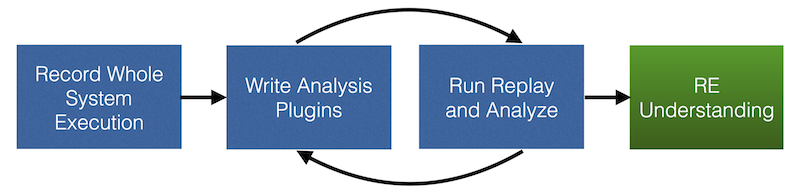
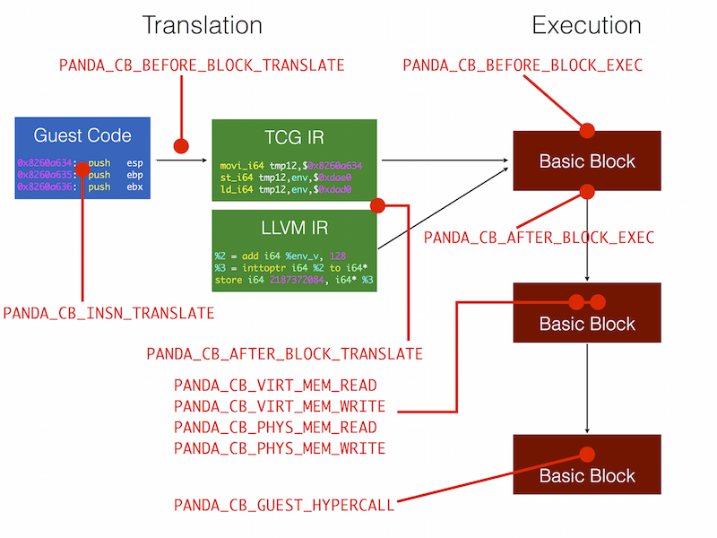

# PANDA User Manual

<!-- START doctoc generated TOC please keep comment here to allow auto update -->
<!-- DON'T EDIT THIS SECTION, INSTEAD RE-RUN doctoc TO UPDATE -->
**Table of Contents**

- [Overview](#overview)
- [FAQ](#faq)
- [Quickstart](#quickstart)
  - [Record](#record)
  - [Replay](#replay)
  - [Analysis](#analysis)
- [A Tour of QEMU](#a-tour-of-qemu)
  - [QEMU's Monitor](#qemus-monitor)
  - [Emulation details](#emulation-details)
  - [What is `env`?](#what-is-env)
  - [Useful PANDA functions](#useful-panda-functions)
    - [QEMU translation control](#qemu-translation-control)
    - [Precise program counter](#precise-program-counter)
    - [Memory access](#memory-access)
    - [LLVM control](#llvm-control)
    - [Record control](#record-control)
    - [Miscellany](#miscellany)
- [Record/Replay Details](#recordreplay-details)
  - [Introduction](#introduction)
  - [Background](#background)
  - [Usage](#usage)
  - [Sharing Recordings](#sharing-recordings)
- [Plugins](#plugins)
  - [Using Plugins](#using-plugins)
  - [Plugin Architecture](#plugin-architecture)
  - [Order of execution](#order-of-execution)
  - [Writing a Plugin](#writing-a-plugin)
    - [Plugin Initialization and Shutdown](#plugin-initialization-and-shutdown)
    - [Callback and Plugin Management](#callback-and-plugin-management)
    - [Argument handling](#argument-handling)
    - [Plugin-plugin interaction](#plugin-plugin-interaction)
    - [Plugin API](#plugin-api)
    - [Plugin callbacks](#plugin-callbacks)
  - [Personal Plugins](#personal-plugins)
    - [Enabling or Disabling Plugins](#enabling-or-disabling-plugins)
  - [Plugin Zoo](#plugin-zoo)
    - [Taint-related plugins](#taint-related-plugins)
      - [Old generation](#old-generation)
    - [Plugins related to Tappan Zee (North) Bridge](#plugins-related-to-tappan-zee-north-bridge)
    - [Callstack Tracking](#callstack-tracking)
    - [Operating System Introspection (OSI) plugins](#operating-system-introspection-osi-plugins)
    - [System call logging & analysis](#system-call-logging-&-analysis)
      - [Current generation](#current-generation)
      - [Old generation](#old-generation-1)
    - [Miscellaneous](#miscellaneous)
- [Pandalog](#pandalog)
  - [Introduction](#introduction-1)
  - [Design](#design)
  - [Adding PANDA Logging to a Plugin](#adding-panda-logging-to-a-plugin)
  - [Building](#building)
  - [Pandalogging During Replay](#pandalogging-during-replay)
  - [Looking at the Logfile](#looking-at-the-logfile)
  - [External References](#external-references)
- [LLVM](#llvm)
  - [Building LLVM](#building-llvm)
  - [Execution](#execution)
  - [How to use it for analysis](#how-to-use-it-for-analysis)
- [Wish List](#wish-list)
- [Appendix A: Callback List](#appendix-a-callback-list)

<!-- END doctoc generated TOC please keep comment here to allow auto update -->


## Overview

PANDA (Platform for Architecture-Neutral Dynamic Analysis) is a whole-system
dynamic analysis engine currently based on QEMU 2.9.1. Its strengths lie in rapid reverse
engineering of software. PANDA includes a system for recording and replaying
execution, a framework for running LLVM analysis on executing code, and an
easily extensible plugin architecture. Together, these basic tools let you
rapidly understand how individual programs work and how they interact at the
system level.

## Quickstart

To build PANDA and it's dependencies, use the install script for your OS,
`panda/scripts/install_*.sh`. See
[our main README](https://github.com/panda-re/panda#building) for more detail.
Don't worry; it won't actually install PANDA to a system
directory, despite the name. If you already have the dependencies you can just
run `qemu/build.sh`. Once it's built, you will find the QEMU binaries in
`i386-softmmu/panda-system-i386`, `x86_64-softmmu/panda-system-x86_64`, and
`arm-softmmu/panda-system-arm`. You'll need to create a qcow (disk image) for use
with PANDA; the internet has documentation on how to do this.

We've found that the most effective workflow in PANDA is to collect a recording
of a piece of execution of interest and then analyze that recording over and
over again. You can read more about record/replay in [our
docs](#recordreplay-details). For now, what you need to know is that record/replay
allows you to repeat an execution trace with all data exactly the same over and
over again. You can then analyze the execution and slowly build understanding
about where things are stored, what processes are running, when the key
execution events happen, etc. Pictorially:



### Record

You can record execution by using the `begin_record` and `end_record` commands
in the QEMU monitor. To use the monitor, run QEMU with `-monitor stdio` (there
are [more complicated setups](https://en.wikibooks.org/wiki/QEMU/Monitor)
too). Type `begin_record "replay_name"` to start the recording process, and use
`end_record` to end it.

Recording will create two files: `replay_name-rr-snp`, the VM snapshot at
beginning of recording, and `replay_name-rr-nondet.log`, the log of all
nondeterministic inputs. You need both of those to reproduce the segment of
execution.

### Replay

You can replay a recording (those two files) using `panda-system-$arch -replay
replay_name`. Make sure you pass the same memory size to the VM as you did for
the recording. Otherwise QEMU will fail with an incomprehensible error.

### Analysis

Once you've captured a replay, you should be able to play it over and over
again. We typically begin by using standard analyses to try and get a basic
picture of what's going on, followed by custom plugins to get more specific
analysis. Plugins reside in the [`panda_plugins`](../plugins)
directory. Although the process depends on the example, some of the plugins we
often use to begin analysis are [`asidstory`](../plugins/asidstory),
[`stringsearch`](../plugins/stringsearch), and
[`file_taint`](../plugins/file_taint).

You can also attach a GDB client to replay, allowing you to debug the guest system using PANDA's [**time-travel debugging**](./time-travel.md).

## A Tour of QEMU

In order to use PANDA, you will need to understand at least some things about
the underlying emulator, QEMU.  In truth, the more you know about QEMU the
better, but that it is a complicated beast.

### QEMU's Monitor

This is how you can access and control the emulator, to do all manner of things
including connecting an ISO to the CD drive and recording execution.  For full
details on what you do with the monitor, consult the QEMU manual.

The most common way of interacting with the monitor is just via `stdio` in the
terminal from which you originally entered the commandline that started up
PANDA.  To get this to work, just add the following to the end of your
commandline: `-monitor stdio`.  There are also ways to connect to the monitor
over a telnet port etc - refer to the QEMU manual for details.

Here are few monitor functions we commonly need with PANDA.

* Connect an ISO to the cd drive: `change ide1-cd0 foo.iso`.
* Begin/end recording: `begin_record foo` and `end_record`.

### Emulation details

QEMU emulates a large number of instruction set architectures, but only a few of
them are heavily used by PANDA reverse engineers.  In particular, PANDA support
is reasonably strong only for `x86`, `arm`, and `ppc`.

It is necessary to have a mental model of how QEMU emulates guest code in order
to write plugins.  Consider a basic block of guest code that QEMU wants to
emulate.  It disassembles that code into guest instructions, one by one,
simultaneously assembling a parallel basic block of instructions in an
intermediate language (IL).  This intermediate language is described in a
[README](https://github.com/moyix/panda/blob/master/qemu/tcg/README) if you are
interested.  From this IL, QEMU generates a corresponding basic block of binary
code that is directly executable on the host.  Note that it is from this QEMU IL
that PANDA generates LLVM instructions, as the two are fairly close already (our
LLVM translation is actually borrowed from the [S2E](http://s2e.epfl.ch/)
project). This basic block of code is actually executed, on the host, in order
to emulate guest behavior. QEMU toggles between translating guest code and
executing the translated binary versions. As a critical optimization, QEMU
maintains a cache of already translated basic blocks.

Here is how some of the plugins fit into that emulation sequence.

* `PANDA_CB_BEFORE_BLOCK_TRANSLATE` is before the initial translation of guest
  code. We don't know length of the block at this point.

* `PANDA_CB_AFTER_BLOCK_TRANSLATE` is after the translation of guest code. In this
  case we know how long the block is.

* `PANDA_CB_BEFORE_BLOCK_EXEC` is after the block of guest code has been
  translated into code that can run on the host and immediately before QEMU runs
  it.

* `PANDA_CB_AFTER_BLOCK_EXEC` is immediately after the block of translated guest
  code has actually been run on the host.

* `PANDA_CB_BEFORE_BLOCK_EXEC_INVALIDATE_OPT` is right after the guest code has
  been translated into code that can run on the host, but before it runs.  In
  some situations, plugin code determines that it is necessary to re-translate
  and can trigger that here, in particular in order to support LLVM lifting and
  taint.

* `PANDA_CB_INSN_TRANSLATE` is just before an instruction is translated, and
  allows inspection of the instruction to control how translation inserts other
  plugin callbacks such as the `INSN_EXEC` one.

* `PANDA_CB_INSN_EXEC` is just before host code emulating a guest instruction
  executes, but only exists if `INSN_TRANSLATE` callback returned true.

NOTE. Although it is a little out of date, the explanation of emulation in
Fabrice Bellard's original USENIX paper on QEMU is quite a good read.  ["QEMU, a
Fast and Portable Dynamic Translator"](https://www.usenix.org/legacy/publications/library/proceedings/usenix05/tech/freenix/full_papers/bellard/bellard.pdf),
USENIX 2005 Annual Technical Conference.

NOTE: QEMU has an additional cute optimization called `chaining` that links up
cached translated blocks of code in such a way that they emulation can
transition from one to another without the emulator being involved.  This is
enabled for record but currently turned off for replay in order to more easily
support callbacks before and after a basic block executes.

### What is `env`?

PANDA plugins need access to cpu registers and state. The QEMU abstract data
type for this `CPUState` and is accessed through a global pointer `env`.  Note
that the *actual* type for an emulated CPU is made more specific in the
`qemu/target-xxx/cpu.h` directory where `xxx` is the architecture in question.
For instance, in `qemu/target-i386/cpu.h`, we find it redefined as `CPUX86State`,
where we also find convenient definitions such as `EAX`, `EBX`, and `EIP`.
Other information of interest such as hidden flags, segment registers, `idt`,
and `gdt` are all available via `env`.

### Useful PANDA functions

These functions don't really form an API to QEMU or PANDA, but they are useful
for controlling PANDA or interacting with QEMU.

#### QEMU translation control

```C
void panda_do_flush_tb(void);
```

This function requests that the translation block cache be flushed as soon as
possible. If running with translation block chaining turned off (e.g. when in
LLVM mode or replay mode), this will happen when the current translation block
is done executing.

Flushing the translation block cache is additionally necessary if the plugin
makes changes to the way code is translated.  For example, by using
`panda_enable_precise_pc`.

**WARNING**: failing to flush the TB before turning on something that alters
code translation may cause QEMU to crash! This is because QEMU's interrupt
handling mechanism relies on translation being deterministic (see the
`search_pc` stuff in `translate-all.c` for details).
```C
void panda_disable_tb_chaining(void);
void panda_enable_tb_chaining(void);
```
These functions allow plugins to selectively turn translation block chaining on
and off, regardless of whether the backend is TCG or LLVM, and independent of
record and replay.

#### Precise program counter

By default, QEMU does not update the program counter after every instruction.
```C
void panda_enable_precise_pc(void);
void panda_disable_precise_pc(void);
```
These functions enable or disable precise tracking of the program counter.
After enabling precise PC tracking, the program counter will be available in
`env->panda_guest_pc` and can be assumed to accurately reflect the guest state.

Some plugins (`taint2`, `callstack_instr`, etc) add instrumentation that runs
*inside* a basic block of emulated code.  If such a plugin is enabled mid-replay
then it is important to flush the cache so that all subsequent guest code will
be properly instrumented.

#### Memory access

PANDA has callbacks for virtual and physical memory read and write, but these
are off by default due to overhead.
```C
void panda_enable_memcb(void);
void panda_disable_memcb(void);
```
Use these two functions to enable and disable the memory callbacks.
```C
int panda_physical_memory_rw(target_phys_addr_t addr, uint8_t *buf, int len, int is_write);
```
This function allows a plugin to read or write `len` bytes of guest physical
memory at `addr` into or from the supplied buffer `buf`. This function differs
from QEMU's `cpu_physical_memory_rw` in that it will never access I/O, only
RAM. This function returns zero on success, and negative values on failure (page not mapped).
```C
int panda_virtual_memory_rw(CPUState *env, target_ulong addr, uint8_t *buf, int len, int is_write);
```
This function is analogous to the previous one except that it uses the current
virtual to physical mapping (page tables) to permit read and write of guest
memory.  It has the same contract but the `addr` is a guest virtual address for
the current process.

#### LLVM control
```C
void panda_enable_llvm(void);
void panda_disable_llvm(void);
```
These functions enable and disable the use of the LLVM JIT in replacement of the
TCG (QEMU intermediate language and compiler) backend.  Here, an additional
translation step is added from the TCG IR to the LLVM IR, and that is executed
on the LLVM JIT.  Currently, this only works when QEMU is starting up, but we
are hoping to support dynamic configuration of code generation soon.

#### Record/Replay and VM control
```C
int panda_vm_quit(void);
int panda_record_begin(const char *name, const char *snapshot);
int panda_record_end(void);
int panda_replay_begin(const char *name);
int panda_replay_end(void);
```
These functions can be used to programatically start/stop recording on PANDA.
Starting/stopping does not happen imediatelly at the time the functions are
called. Instead, a request to start/stop recording is registered to be applied
at the end of the currently executing basic block. Only one request can be
queued at any time.
The `name` argument is mandatory and is used to derive the snapshot/log
filenames to be created/used.
The `snapshot` argument is optional (i.e. can be `NULL`). If supplied,
the state of the VM will be reverted to the QEMU snapshot with that name.

Possible return values are:
  * `RRCTRL_OK`: Request registered successfully.
  * `RRCTRL_EPENDING`: Request ignored because another record/replay state
    change request is pending.
  * `RRCTRL_ERROR`: Request is invalid. E.g. because you are trying to end
    a recording during a replay.

#### Miscellany
  * ```C
    void panda_memsavep(FILE *out);
    ```
    Saves a physical memory snapshot into the open file pointer `out`.
    This function is guaranteed not to perturb guest state.
  * ```C
    target_ulong panda_current_asid(CPUState *cpu);
    ```
    Returns the current asid for any of the PANDA supported
    architectures (e.g. `cr3` for x86).
  * ```C
    bool panda_in_kernel(CPUState *cpu);
    ```
    Returns `true` if the processor is in the privilege level
    corresponding to executing kernel code for any of the PANDA
    supported architectures.
  * ```C
    target_ulong panda_current_sp(CPUState *cpu);
    ```
    Returns the guest stack pointer for any of the PANDA supported
    architectures.
  * ```C
    target_ulong panda_get_retval(CPUState *cpu);
    ```
    Retrieves the return value of a returned call for any of the
    PANDA supported architectures. The function has to be called in
    the proper context in order to return a meaningful value. If the
    context is not right (i.e. the return value has already been
    overwritten), it will return garbage.
  * ```C
    void panda_disas(FILE *out, void *code, unsigned long size);
    ```
    Writes a textual representation of disassembly of the guest code
    at virtual address `code` of `size` bytes.

## Record/Replay Details

### Introduction

PANDA supports whole system deterministic record and replay in whole
system mode on the `i386`, `x86_64`, and `arm` targets. We hope to add more
soon; for example, partial SPARC support exists but is not yet reliable.

### Background

Deterministic record and replay is a technique for capturing the
*non-deterministic inputs* to a system -- that is, the things that would
cause a system to behave differently if it were re-started from the
same point with the same inputs. This includes things like network
packets, hard drive reads, mouse and keyboard input, etc.

Our implementation of record and replay focuses on reproducing code
execution. That is, the non-deterministic inputs we record are changes
made to the CPU state and memory -- DMA, interrupts, `in` instructions,
and so on. Unlike many record and replay implementations, we do *not*
record the inputs to devices; this means that one cannot "go live"
during a recording, but it greatly simplifies the implementation. To get
an idea of what is recorded, imagine drawing a line around the CPU and
RAM; things going from the outside world to the CPU and RAM, crossing
this line, must be recorded.

Record and replay is extremely useful because it enables many
sophisticated analysis that are too slow to run in real-time; for
example, trying to do taint flow analysis makes the guest system so slow
that it cannot make network connections (because remote systems time out
before the guest can process the packets and respond). By creating a
recording, which has fairly modest overhead, and performing analyses on
the replayed execution, one can do analyses that simply aren't possible
to do live.

### Usage

Recording is controlled with two QEMU monitor commands, begin_record and
end_record:

* `begin_record <name>`

    Starts a recording session, saved as `<name>`. Note that there is
    currently no safeguard to prevent overwriting previous recordings,
    so be careful to choose a unique name.

    The recording log consists of two parts: the snapshot, which is
    named `<name>-rr-snp`, and the recording log, which is named
    `<name>-rr-nondet.log`.

* `end_record`

    Ends an active recording session. The guest will be paused, but can
    be resumed and another recording can be made once the guest is
    resumed.

A commandline flag `-record-from <snapshot>:<record-name>` to restores a
qcow2 snapshot and immediately start recording is also provided for convenience.

Start replays from the command line using the `-replay <name>` option.

Of course, just running a replay isn't very useful by itself, so you
will probably want to run the replay with some plugins enabled that
perform some analysis on the replayed execution. See [Plugins](#Plugins) for
more details.

You can also debug the guest under replay using PANDA's [**time-travel debugging**](./time-travel.md).

### Sharing Recordings

To make it easier to share record/replay logs, PANDA has two scripts,
`rrpack.py` and `rrunpack.py`, that bundle up and compress a recording.
These can be found in the `scripts` directory. To pack up a recording,
just use:

    scripts/rrpack.py <name>

This will bundle up `<name>-rr-snp` and `<name>-rr-nondet.log` and put
them into PANDA's packed record/replay format in a file named
`<name>.rr`. This file can be unpacked and verified using:

    scripts/rrunpack.py <name>.rr

A central repository for sharing record/replay logs is available at the [PANDA
Share](http://www.rrshare.org/) website.

## Plugins

A great deal of the power of PANDA comes from its abiltiy to be extended with
plugins.  Plugins are an easy way to extend the features of PANDA, and allow a
wide range of dynamic analyses to be implemented without modifying QEMU.

### Using Plugins

You will probably begin experimenting with PANDA by just using the plugins
others have written.  To load a PANDA plugin, you must specify it via `-panda`
on the QEMU command line followed by the plugin name. You can specify multiple
plugins as a semicolon-separated list, and you can give the plugins arguments as
a comma-separated list after the plugin's name and a colon. For example:

	-panda 'stringsearch;callstack_instr;llvm_trace:base=/tmp,foo=6'

This loads the `stringsearch`, `callstack_instr`, and `llvm_trace` plugins and
passes `llvm_trace` the arguments `base=dir` and `foo=bar`. Note that the `;`
character must be escaped in most shells; you can either surround the arguments
with quotes (as in this example) or just escape the semicolon itself,
e.g. `base=dir\;foo=bar`.

Plugins are automatically unloaded when a replay ends.

### Plugin Architecture

Plugins allow you to register callback functions that will be executed at
various points as QEMU executes.  While it is possible to register and run
callbacks during *record*, it is more usual for plugins to be used during
replay.  The PANDA RE workflow is (see Overview section for diagram) record,
then replay multiple times under a variety of plugins, possibly some of which
have been written for the RE task at hand.

Some of these callbacks and where they occur in
QEMU's execution are shown below:



### Order of execution

If you are using multiple plugins that work together to perform some analysis,
you may care about what order plugins' callbacks execute in, since some
operations may not make sense if they're done out of order.

The bad news is that PANDA does not guarantee any fixed ordering for its
callbacks across different plugins. In the current implementation, each callback
of a given type will be executed in the order it was registered.
Although this creates a deterministic order for callbacks of a specific type
within one plugin, a fixed callback execution order among multiple distinct
plugins can not be ensured.
(Usually, this order corresponds to the order in which the plugins were loaded;
however, because callbacks can be registered at any time throughout a plugin's
lifetime, this is not guaranteed to hold true). This could change in the future,
though, and in general it's not a good idea to rely on it.

The good news is that there's a better way to enforce an ordering. As described
in the next section, plugins support explicit mechanisms for interacting with
each other. In particular, you can create plugin callbacks, which allow plugins
to notify each other when certain events inside the plugin occur. For example,
if you wanted to ensure that something in Plugin B always happens after Plugin A
does some action `foo`, Plugin A would create an `on_foo` callback that Plugin B
could then register with. This is much safer and more robust than trying to
guess the order in which the plugin callbacks will be called.

See the Plugin-Plugin Interaction section for details on this mechanism.

### Writing a Plugin

To create a PANDA plugin, create a new directory inside `plugins`,
and copy `Makefile.example` into
`plugins/${YOUR_PLUGIN}/Makefile`. Then edit the Makefile to suit the
needs of your plugin (at minimum, you should change the plugin name). By
default, the source file for your plugin must be named `${YOUR_PLUGIN}.(c|cpp)`,
but this can be changed by editing the Makefile.

To have your plugin compiled as part of the main QEMU build process, you should
add it to `plugins/config.panda`.  Note that plugins in that list can
be disable (excluded from compilation) by commenting them out with a `#`.
Plugins can currently be written in either C or C++.

When you run `make`, the QEMU build system will build your plugin for each
target architecture that was specified in `./configure --target-list=`. This
means that architecture-specific parts of your plugin should be guarded using
code like:
```C
#if defined(TARGET_I386)
// Do x86-specific stuff
#elif defined(TARGET_ARM)
// Do ARM-specific stuff
#endif
```
It also means that your code can use the various target-specific macros, such as
`target_ulong`, in order to get code that works with all of QEMU's
architectures.

#### Plugin Initialization and Shutdown

All plugins are required to contain, at minimum, two functions with the
following signatures:
```C
bool init_plugin(void *self);
void uninit_plugin(void *self);
```
The single void * parameter is a handle to the plugin; because this comes from
`dlopen`, it can be safely used with `dlsym` and friends. This handle is also
what should be passed to `panda_register_callback` in order to register a plugin
function as a callback.

In general, `init_plugin` should perform any setup the plugin needs, and call
`panda_register_callback` to tell PANDA what plugin functions to call for
various events. For example, to register a callback that will be executed after
the execution of each basic block, you would use the following code:
```C
pcb.after_block_exec = after_block_callback;
panda_register_callback(self, PANDA_CB_AFTER_BLOCK_EXEC, pcb);
```
The `uninit_plugin` function will be called when the plugin is unloaded. You
should free any resources used by the plugin here, as plugins can be unloaded in
mid replay or from the monitor – so you can't rely on QEMU doing all your
cleanup for you.

#### Callback and Plugin Management

Typically in the `init_plugin` function, you will register a number of
callbacks.
```C
void panda_register_callback(void *plugin, panda_cb_type type, panda_cb cb);
```
Registers a callback with PANDA. The `type` parameter specifies what type of
callback, and `cb` is used for the callback itself (`panda_cb` is a union of all
possible callback signatures).
```C
PANDA_CB_BEFORE_BLOCK_TRANSLATE,// Before translating each basic block
PANDA_CB_AFTER_BLOCK_TRANSLATE, // After translating each basic block
PANDA_CB_BEFORE_BLOCK_EXEC_INVALIDATE_OPT,    // Before executing each basic block (with option to invalidate, may trigger retranslation)
PANDA_CB_BEFORE_BLOCK_EXEC,     // Before executing each basic block
PANDA_CB_AFTER_BLOCK_EXEC,      // After executing each basic block
PANDA_CB_INSN_TRANSLATE,        // Before an instruction is translated
PANDA_CB_INSN_EXEC,             // Before an instruction is executed
PANDA_CB_AFTER_INSN_TRANSLATE,  // After an insn is translated
PANDA_CB_AFTER_INSN_EXEC,       // After an insn is executed
PANDA_CB_VIRT_MEM_BEFORE_READ,  // Before read of virtual memory
PANDA_CB_VIRT_MEM_BEFORE_WRITE, // Before write to virtual memory
PANDA_CB_PHYS_MEM_BEFORE_READ,  // Before read of physical memory
PANDA_CB_PHYS_MEM_BEFORE_WRITE, // Before write to physical memory
PANDA_CB_VIRT_MEM_AFTER_READ,   // After read of virtual memory
PANDA_CB_VIRT_MEM_AFTER_WRITE,  // After write to virtual memory
PANDA_CB_PHYS_MEM_AFTER_READ,   // After read of physical memory
PANDA_CB_PHYS_MEM_AFTER_WRITE,  // After write to physical memory
PANDA_CB_MMIO_AFTER_READ,       // After each MMIO read
PANDA_CB_MMIO_BEFORE_WRITE,     // Before each MMIO write
PANDA_CB_HD_READ,               // Each HDD read
PANDA_CB_HD_WRITE,              // Each HDD write
PANDA_CB_GUEST_HYPERCALL,       // Hypercall from the guest (e.g. CPUID)
PANDA_CB_MONITOR,               // Monitor callback
PANDA_CB_CPU_RESTORE_STATE,     // In cpu_restore_state() (fault/exception)
PANDA_CB_BEFORE_LOADVM,         // At start of replay, before loadvm
PANDA_CB_ASID_CHANGED,          // After an ASID (address space identifier - aka PGD) write
PANDA_CB_REPLAY_HD_TRANSFER,    // In replay, hd transfer
PANDA_CB_REPLAY_NET_TRANSFER,   // In replay, transfers within network card (currently only E1000)
PANDA_CB_REPLAY_SERIAL_RECEIVE, // In replay, right after data is pushed into the serial RX FIFO
PANDA_CB_REPLAY_SERIAL_READ,    // In replay, right after a value is read from the serial RX FIFO.
PANDA_CB_REPLAY_SERIAL_SEND,    // In replay, right after data is popped from the serial TX FIFO
PANDA_CB_REPLAY_SERIAL_WRITE,   // In replay, right after data is pushed into the serial TX FIFO.
PANDA_CB_REPLAY_BEFORE_DMA,     // In replay, just before RAM case of cpu_physical_mem_rw
PANDA_CB_REPLAY_AFTER_DMA,      // In replay, just after RAM case of cpu_physical_mem_rw
PANDA_CB_REPLAY_HANDLE_PACKET,  // In replay, packet in / out
PANDA_CB_AFTER_CPU_EXEC_ENTER,  // Just after cpu_exec_enter is called
PANDA_CB_BEFORE_CPU_EXEC_EXIT,  // Just before cpu_exec_exit is called
PANDA_CB_AFTER_MACHINE_INIT,    // Right after the machine is initialized, before any code runs
PANDA_CB_AFTER_VMLOAD,          // Right after machine state is restored from a snapshot, before any code runs
PANDA_CB_TOP_LOOP,              // At top of loop that manages emulation.  good place to take a snapshot
```
For more information on each callback, see the "Callbacks" section.
```C
void * panda_get_plugin_by_name(const char *name);
```
Retrieves a handle to a plugin, given its name (the name is just the base name
of the plugin's filename; that is, if the path to the plugin is
`qemu/panda/panda_test.so`, the plugin name will be `panda_test.so`).

This can be used to allow one plugin to call functions another, since the handle
returned is usable with `dlsym`.
```C
bool   panda_load_plugin(const char *filename);
```
Load a PANDA plugin. The `filename` parameter is currently interpreted as a
simple filename; no searching is done (this may change in the future). This can
be used to allow one plugin to load another.
```C
void   panda_unload_plugin(void *plugin);
```
Unload a PANDA plugin. This can be used to allow one plugin to unload another
one.
```C
void   panda_disable_plugin(void *plugin);
```
Disables callbacks registered by a PANDA plugin. This can be used to allow one
plugin to temporarily disable another one.
```C
void   panda_enable_plugin(void *plugin);
```
Enables callbacks registered by a PANDA plugin. This can be used to re-enable
callbacks of a plugin that was disabled.

#### Argument handling

PANDA allows plugins to receive arguments on the command line. For instance,
consider that example from above.

    -panda 'stringsearch;callstack_instr;llvm_trace:base=/tmp,foo=6'

The `llvm_trace` plugin has two arguments, `base` and `foo` with values `/tmp`
and `6`.  In `init_plugin` for `llvm_trace`, include the following code to
retrieve just the arguments for the `llvm_trace` plugin and then to parse the individual arguments.

```C
panda_arg_list *args = panda_get_args("llvm_trace");
uint32_t foo = panda_parse_uint32(args, "foo", 0);
char *base = panda_parse_string(args, "base", NULL);
```

Here is the complete list of PANDA arg parsing functions.

```C
target_ulong panda_parse_ulong(panda_arg_list *args, const char *argname, target_ulong defval);
uint32_t panda_parse_uint32(panda_arg_list *args, const char *argname, uint32_t defval);
uint64_t panda_parse_uint64(panda_arg_list *args, const char *argname, uint64_t defval);
double panda_parse_double(panda_arg_list *args, const char *argname, double defval);
bool panda_parse_bool(panda_arg_list *args, const char *argname);
const char *panda_parse_string(panda_arg_list *args, const char *argname, const char *defval);
```

Note that calling `panda_get_args` allocates memory to store the list, which
should be freed after use with `panda_free_args`.

```C
void panda_free_args(panda_arg_list *args);
```

Frees an argument list created with `panda_get_args`.


#### Plugin-plugin interaction

It's often very handy to be able to allow plugins to interact with one another.
For example, the `taint2` tracks taint, and exposes an API for labeling data and
querying what taint labels are on some data. This allows one to create plugins
that are small and do one thing well but can be composed together to accomplish
complex tasks.

There three kinds of plugin-plugin-interaction: exposing an API that other
plugins can call, defining callback points that other plugins can register with
to be notified when something of interest occurs, and turning another plugin on
or off.

Interactions between plugins, however, are tricky because PANDA plugins are
dynamically loaded. Thus, even if Plugin A has a function intended to be called
by another plugin, it is painful to obtain access to that function from Plugin B
(hint: `dlsym` is involved). Further, the code necessary to iterate over a
sequence of callbacks is annoying and formulaic.Software engineering to the
rescue! `panda/plugin_plugin.h` provides a number of convenient macros that
simplify arranging for these two types of plugin interaction. Here is how to use
them.

#### Plugin API

To export an API for use in another plugin:

1. Create a file named `<plugin>_int_fns.h` in the plugin's directory and list
   each function's prototype, along with any data types it requires.
2. Create a file named `<plugin>_int.h` in the plugin's directory looks like:

```C
typedef void YourCustomType;
typedef void YourOtherCustomType;

#include "<plugin>_int_fns.h"
```
This slightly insane-looking arrangement is necessary because the `apigen.py`
script (which is invoked from `build.sh`) uses `pycparser` to parse each
plugin's `<plugin>_int.h` header and generate the necessary code to seamlessly
use the API from other plugins. Unfortunately, `pycparser` is not great at
understanding custom types (i.e. anything that's not in the standard system
headers), so you have to use `typedefs` to make `pycparser` happy. This is
indeed ridiculous, and if you have a better way to do it we'd welcome your pull
request with open arms.

At build time, `apigen.py` will automatically find all the plugins with those
files, and generate a `<plugin>_ext.h` file for each one, in the plugin's
directory. To use the API, one simply needs to `#include "../<plugin>/<plugin>_ext.h"`
and then call `init_<plugin>_api()` and ensure that its return value is `true`.

For example, to use the functions exported by the `sample` plugin, you can do
something like:

```C
#include "../sample/sample_ext.h"

void some_other_callback() {
    // This function is defined in sample_ext.h but can be used here
    sample_function();
}

bool init_plugin(void *self) {
    if (!init_sample_api()) return false;
    return true;
}
```

#### Plugin callbacks

Suppose you have Plugin A and Plugin B, and Plugin B wants to be notified when
something interesting happens in Plugin A. There are two halves to this:
creating the pluggable place in Plugin A, and registering a callback implemented
in Plugin B with Plugin A.

In order to create the pluggable place in Plugin A, you have to do the
following.

1. Determine at precisely what line in A you want callbacks to run. Also,
   decide what arguments the callback functions will take. Also also, choose a
   name for the callback, e.g., `foo`.

2. Create a type for the callback function. Put this in the .h file for Plugin
   A. If the callback's name is `foo`, then this type has to be called `foo_t`.

3. Use the macro `PPP_RUN_CB` at the line chosen in 1. This macro takes all the
   arguments you want the callback to get, so it will look like a function call.
   But it will expand into code that runs all callbacks registered to run there,
   handing each all those args.

4. In the same file you edited in 3, use the macro `PPP_CB_BOILERPLATE`
   somewhere above the line decided in 1, just not inside of a function. This
   macro takes a single argument, the callback name, and expands into a bunch of
   necessary code: a global array of function pointers, an integer keeping track
   of how many functions have been registered, and a pair of functions that can
   be used from outside Plugin A to register callbacks.

5. In the same file you edited in 3, in the `extern "C" {` portion near the top
   of the file, add `PPP_PROT_REG_CB(foo);`. For more information on this, see
   `panda/plugin_plugin.h`.

6. Remember to `#include "panda/plugin_plugin.h"` at the top of the edited
   source file.

In order to register a callback with Plugin A that is defined in Plugin B, all
you need to do is use the `PPP_REG_CB` macro in Plugin B's init_plugin function
and include Plugin A's .h file where the type for the callback is defined (see
\#2). This macro takes three arguments. The first is the name of plugin A (as
in, its name in the Makefile). The second is the callback name. The third is the
function in B that is to be registered with A.

A good example of how all this fits together can be seen in the interaction
between the `stringsearch` and `tstringsearch` plugins. `stringsearch` is plugin
A. It has one pluggable site: when a string match occurs. The name of that
callback is `on_ssm` for "on stringsearch match". Look in `stringsearch.h` to
see the type definition for the callback functions `on_ssm_t`. Look in
`stringsearch.cpp` for the macro invocations of `PPP_RUN_CB` and
`PPP_CB_BOILERPLATE`. `tstringsearch` is plugin B. It contains a function
`tstringsearch_match` which it registers with `stringsearch` via the
`PPP_REG_CB` macro in order to apply taint labels to any string match. Their
powers combined, these two plugins allow us to perform a complicated task
(content-based taint labeling).


### Personal Plugins

You can also pull plugin code from some other directory, i.e., not from
`panda/panda/plugins`.  This allows you to maintain a separate repository
of your personal plugins.

1. Create a directory in which you will create personal plugins.  `/home/you/personal`
2. Create a subdirectory `personal/panda/plugins` there as well.
4. Say you have written a plugin you want to call `new_cool`.  Create a subdirectory `personal/panda/plugins/new_cool` and put the code for the new plugin there.
5. Create a file `panda/plugins/config.panda` with names of enabled plugins as you would normally.
6. You can use the the same makefile set-up as with regular plugins.
7. configure with `--extra-plugins-path=/home/you/personal`
8. Build as usual and you should compile `new_cool` plugin and its compiled code will be deposited in, e.g., `i386-softmmu/panda_plugins`

#### Enabling or Disabling Plugins

PANDA offers four functions for enabling and disabling other plugins at runtime:
`panda_load_plugin`, `panda_unload_plugin`, `panda_enable_plugin`, and
`panda_disable_plugin`. The former completely load or unload plugins while the
latter allow to temporarily enable or disable callbacks registered by a given
plugin). For their prototypes, have a look at `panda_plugin.h`.

### Plugin Zoo

We have written a bunch of generic plugins for use in analyzing replays. Each
one has a README.md file linked here for further explanation.

#### Taint-related plugins
* [`taint2`](../plugins/taint2/README.md) - Modern taint plugin. Required by most other taint plugins. `Already ported from panda1`
* [`ida_taint2`](../../../panda1/qemu/panda_plugins/ida_taint2/README.md) - IDA taint
  integration.
* [`file_taint`](../plugins/file_taint/README.md) - Syscall and
  OSI-based automatic tainting of file input by filename. `Already ported from panda1`
* [`tainted_branch`](../plugins/tainted_branch/README.md) - Find
  conditional branches where the choice depends on tainted data. `Already ported from panda1`
* [`tainted_instr`](../plugins/tainted_instr/README.md) - Find
  instructions which process tainted data.
* [`taint_compute_numbers`](../../../panda1/qemu/panda_plugins/taint_compute_numbers/README.md)
  \- Analyze taint compute numbers (computation tree depth) for tainted data.
* [`tstringsearch`](../plugins/tstringsearch/README.md) - Automatically
  taint all occurrences of a certain string.

##### Old generation
* [`taint`](../../../panda1/qemu/panda_plugins/taint/README.md) - Old taint plugin.
* [`ida_taint`](../../../panda1/qemu/panda_plugins/ida_taint/README.md) - IDA taint
  integration for old taint plugin.

#### Plugins related to [Tappan Zee (North) Bridge](http://wenke.gtisc.gatech.edu/papers/tzb.pdf)
* [`stringsearch`](../plugins/stringsearch/README.md) - Mine memory accesses for a particular string. `Already ported from panda1`
* [`textfinder`](../../../panda1/qemu/panda_plugins/textfinder/README.md)
* [`textprinter`](../plugins/textprinter/README.md)
* [`textprinter_fast`](../../../panda1/qemu/panda_plugins/textprinter_fast/README.md)
* [`unigrams`](../plugins/unigrams/README.md)
* [`bigrams`](../../../panda1/qemu/panda_plugins/bigrams/README.md)
* [`memdump`](../../../panda1/qemu/panda_plugins/memdump/README.md)
* [`keyfind`](../../../panda1/qemu/panda_plugins/keyfind/README.md)
* [`memsnap`](../../../panda1/qemu/panda_plugins/memsnap/README.md)
* [`memstrings`](../../../panda1/qemu/panda_plugins/memstrings/README.md)
* [`correlatetaps`](../../../panda1/qemu/panda_plugins/correlatetaps/README.md)
* [`tapindex`](../../../panda1/qemu/panda_plugins/tapindex/README.md)

#### Callstack Tracking
* [`callstack_instr`](../plugins/callstack_instr/README.md) -
  Instruction-based callstack tracing. `Already ported from panda1`
* [`fullstack`](../../../panda1/qemu/panda_plugins/fullstack/README.md)
* [`printstack`](../../../panda1/qemu/panda_plugins/printstack/README.md)
* [`callstack_block_pc`](../../../panda1/qemu/panda_plugins/callstack_block_pc/README.md) -
  Old block-based callstack tracing.

#### Operating System Introspection (OSI) plugins
* [`osi`](../plugins/osi/README.md) - Operating system introspection
  framework. `Already ported from panda1`
* [`osi_linux`](../plugins/osi_linux/README.md) - Generic Linux OSI. `Already ported from panda1`
* [`osi_test`](../plugins/osi_test/README.md)
* [`osi_winxpsp3x86`](../../../panda1/qemu/panda_plugins/osi_winxpsp3x86/README.md) - OSI for
  Windows XP SP3 x86.
* [`asidstory`](../plugins/asidstory/README.md) - ASCII art view of
  process execution inside VM. `Already ported from panda1`
* [`linux_vmi`](../../../panda1/qemu/panda_plugins/linux_vmi/README.md) - Alternate Linux OSI
  system from DECAF.
* [`debianwheezyx86intro`](../../../panda1/qemu/panda_plugins/debianwheezyx86intro/README.md) -
  OSI for Debian 7 x86.
* [`testdebintro`](../../../panda1/qemu/panda_plugins/testdebintro/README.md)
* [`win7x86intro`](../plugins/win7x86intro/README.md) - OSI for Windows
  7 x86.

#### System call logging & analysis

##### Current generation
* [`syscalls2`](../plugins/syscalls2/README.md) - Modern syscalls tracking. `Already ported from panda1`
* [`win7proc`](../../../panda1/qemu/panda_plugins/win7proc/README.md) - Semantic pandalog
  interpretation of syscalls for Windows 7 x86.

##### Old generation
* [`syscalls`](../../../panda1/qemu/panda_plugins/syscalls/README.md) - Old syscalls tracking.
* [`fdtracker`](../../../panda1/qemu/panda_plugins/fdtracker/README.md) - Old file descriptor
  tracking.

#### Miscellaneous
* [`bir`](../../../panda1/qemu/panda_plugins/bir/README.md) - Binary Information Retrieval.
  Used to correspond executables on disk with code executing in memory.
* [`tralign`](../../../panda1/qemu/panda_plugins/tralign/README.md) - Align parts of execution
  traces.
* [`bufmon`](../../../panda1/qemu/panda_plugins/bufmon/README.md) - Monitor all memory accesses
  to a particular memory region.
* [`coverage`](../plugins/coverage/README.md)
* [`llvm_trace`](../../../panda1/qemu/panda_plugins/llvm_trace/README.md) - Record trace of
  dynamic information necessary for later analysis.
* [`lsmll`](../../../panda1/qemu/panda_plugins/lsmll/README.md)
* [`memsavep`](../plugins/memsavep/README.md) - Create a dump of
  physical memory at a given point in a replay. The dump can then be fed to
  Volatility. `Already ported from panda1`
* [`memstats`](../../../../../panda1/qemu/panda_panda1/qemu/panda_plugins/memstats/README.md)
* [`network`](../plugins/network/README.md)
* [`pmemaccess`](../../../panda1/qemu/panda_plugins/pmemaccess/README.md)
* [`recctrl`](../plugins/recctrl/README.md) - Control recording from within the VM.
* [`rehosting`](../../../panda1/qemu/panda_plugins/rehosting/README.md)
* [`replaymovie`](../plugins/replaymovie/README.md) - Write a series of
  framebuffer screenshots to the current directory. Use movie.sh to turn them
  into a movie.
* [`sample`](../../../panda1/qemu/panda_plugins/sample/README.md)
* [`scissors`](../plugins/scissors/README.md) - Cut out a smaller piece
  of a given replay. `Already ported from panda1`
* [`useafterfree`](../../../panda1/qemu/panda_plugins/useafterfree/README.md) - Track memory
  allocations and search for uses after frees.


## Pandalog

### Introduction

PANDA analyses run on whole system replays and the clear temptation is to just
print out what you learn as you learn it. So panda plugins often begin life
peppered with print statements. There is nothing wrong with print statements.
But, as a plugin matures, it is usual for the consumers of those print
statements to yearn for more compact, more parseable output. Pandalog provides
this in the form of protocol buffer messages, streamed to a file through zlib's
file access functions.


### Design

Pandalog is designed to be

1. Fast to read and write
2. Small log size
3. Easy to add to a plugin
4. Easy to write code that reads the log
5. Useable from any C or C++ panda plugin

Goals 1 and 2 are (arguably) provided by Google's protocol buffers.  Protocol
buffers optimize for small message size.  Marshalling / unmarshalling is
reasonably speedy.  Better than JSON.  We would have liked to use something like
flatbuffers (also from Google), which is optimized more for read/write speed (we
want FAST plugins, dammit).  But this would have violated goal 5, as there is no
way to auto-generate code for C with flatbuffers, as yet.  A big design goal
here (3) was for the logging spec to be distributed throughout the plugins.
That is, if new plugin foo wants to write something to the pandalog, it should
only have to specify what new fields it wants to add to the pandalog and add the
actual logging statements.

### Adding PANDA Logging to a Plugin

There's both a C and C++ API for pandalogging; as of late 2017, the C API is just a wrapper around the C++ that exists for compatibility with C plugins.


For both C and C++, the first step is creating a protobuf schema. The `asidstory` plugin is a good example.

    $ cd plugins/asidstory/
    $ cat asidstory.proto
    optional uint64 asid = 3;
    optional string process_name = 4;
    optional uint32 process_id = 5;

This file contains a snippet from a protocol buffer schema.  It indicates that
this plugin will be adding three new optional fields to the pandalog, one for
the `asid` (address space id), one for the `process_name`, and another for the
`process_id`.  Note that these fields are given *tag numbers*.  This is
important in so far as no two protobuf fields can have the same number (we don't
know why).  That is a global constraint you need to be aware of across all
plugins.  If `asidstory` uses slot 3, then plugin `foo` better not try to use it
as well.  Don't worry; if you screw this up, you'll get an error at build time.

#### C interface

Asidstory is also an example of using the old pandalog C API.

```C
extern "C" {
...
#include "panda/plog.h"
...
}
...
int asidstory_before_block_exec(CPUState *env, TranslationBlock *tb) {
...
       if (pandalog) {
        if (last_name == 0
            || (p->asid != last_asid)
            || (p->pid != last_pid)
            || (0 != strcmp(p->name, last_name))) {
            Panda__LogEntry ple = PANDA__LOG_ENTRY__INIT;
            ple.has_asid = 1;
            ple.asid = p->asid;
            ple.has_process_id = 1;
            ple.process_id = p->pid;
            ple.process_name = p->name;
            pandalog_write_entry(&ple);
            last_asid = p->asid;
            last_pid = p->pid;
            free(last_name);
            last_name = strdup(p->name);
        }
    }
...
```
The logging message was inserted into the function
`asidstory_before_block_exec`, and the logic is complicated by the fact that we
are keeping track of the last asid, process name, and process id.  When any of
them change, we write a pandalog message.  All of that is incidental.

Note that we have available to us a global `pandalog`, which we can use to
determine if panda logging is turned on.

To add the logging message, you have to create the `ple`, initializing it as so:
```C
Panda__LogEntry ple = PANDA__LOG_ENTRY__INIT;
```

The definition of the `Panda__LogEntry` struct can be found in `plog.pb-c.h`
in your PANDA build directory. One such header file exists per target architecture.
All you have to do is to populate `ple` with the fields that you want to log.
For optional scalar fields, there is always a `has_fieldname` bool you need to
set to indicate their presence. For optional pointer or string fields, a NULL value
indicates that the field is not present.

Here is the part of the code above in which we populate the struct for logging:
```C
ple.has_asid = 1;
ple.asid = p->asid;
ple.has_process_id = 1;
ple.process_id = p->pid;
ple.process_name = p->name;
```
Now all that is left is to write the entry to the pandalog.
```C
pandalog_write_entry(&ple);
```

The above C functions are defined in `panda/include/panda/plog.h` and `panda/src/plog.c`, but you'll notice that they are just wrappers around C++ functions. The wrappers simply pass on the data to the C++ functions that actually do the work of reading/writing to the log. The functions that bridge the two are declared in `panda/include/panda/plog-cc-bridge.h`.

#### C++ Interface

Using the C++ API is similar. The main difference is that there is a global object of the `PandaLog` class called `globalLog`, which all plugins use to read and write from the log. In addition, the C++ protobuf code provides the `LogEntry` class under the `panda` namespace, and getter and setter functions for the fields.

It's also recommended to use `std::unique_ptrs` to initialize each `LogEntry`, for automatic memory management. Here's an example of this:

```c
extern PandaLog globalLog;
...
if (pandalog){
    std::unique_ptr<panda::LogEntry> ple (new panda::LogEntry());
    ple->mutable_llvmentry()->set_type(FunctionCode::FUNC_CODE_INST_CALL);
    ple->mutable_llvmentry()->set_address(addr);

    globalLog.write_entry(std::move(ple));
}
```

The `panda::LogEntry` class is defined in the autogenerated `plog.pb.h`, and the `PandaLog` class is in `panda/src/plog-cc.cpp`.

### Building
Any `.proto` files you add will be automatically picked up by the PANDA
Makefile and concatenated into a single `plog.proto` file per target architecture.
These files are subsequently processed by the `protoc` and `protoc-c` compilers to autogenerate the C++ and C protobuf files: `plog.pb.[cc/h]` and `plog.pb-c.[c/h]`.

All the generated files are located under the target-specific
subdirectories of your PANDA build directory.
E.g. `build-panda/arm-softmmu/plog.pb-c.h`.

Feel free to peek at any of those auto-generated files.
In particular, you will probably want to consult the headers,
since they defines the logging structs `Panda__LogEntry` and `panda::LogEntry`.

### Pandalogging During Replay

PANDA logging is enabled at runtime with a new command-line arg.

    -pandalog filename

Any specified plugins that write to the pandalog will log to that file, which is
written via `zlib` file access functions for compression.

### Looking at the Logfile

There is a small program in `panda/src/plog_reader.cpp`, which also serves as an example of reading/writing with the C++ pandalog API.
Compilation directions are at the head of that source file. You can also use the `panda/scripts/plog_reader.py` script to view a log, which is more convenient but slower.

You can read a pandalog using either program and also see how easy it is to
unmarshall the pandalog.  Here's how to use it and some of its output.

    $ ./pandalog_reader /tmp/pandlog | head
    instr=16356  pc=0xc12c3586 :  asid=2 pid=171 process=[jbd2/sda1-8]
    instr=78182  pc=0xc12c3586 :  asid=2 pid=4 process=[kworker/0:0]
    instr=80130  pc=0xc12c3586 :  asid=2 pid=171 process=[jbd2/sda1-8]
    instr=142967  pc=0xc12c3586 :  asid=2 pid=4 process=[kworker/0:0]
    instr=209715  pc=0xc12c3586 :  asid=7984000 pid=2511 process=[sshd]
    instr=253940  pc=0xc12c3586 :  asid=2 pid=4 process=[kworker/0:0]
    instr=256674  pc=0xc12c3586 :  asid=5349000 pid=2512 process=[bash]
    instr=258267  pc=0xc12c3586 :  asid=7984000 pid=2511 process=[sshd]
    instr=262487  pc=0xc12c3586 :  asid=2 pid=4 process=[kworker/0:0]
    instr=268164  pc=0xc12c3586 :  asid=5349000 pid=2512 process=[bash]

Note that there are two required fields always added to every pandalog entry:
instruction count and program counter.  The rest of these log messages come from
the asidstory logging.

### External References

You may want to search google for "Protocol Buffers" to learn more about it.

## LLVM

PANDA uses the LLVM architecture from the [S2E
project](https://github.com/dslab-epfl/s2e). This means you can translate from
QEMU's intermediate representation, TCG, to LLVM IR, which is easier to
understand and platform-independent. We call this process "lifting". Lifting has
non-trivial overhead, but it enables complex analyses like our `taint2` plugin.

### Building LLVM

To build LLVM (if your OS does not have llvm-3.3 packages), run the following
script:
```bash
cd panda
svn checkout http://llvm.org/svn/llvm-project/llvm/tags/RELEASE_33/final/ llvm
cd llvm/tools
svn checkout http://llvm.org/svn/llvm-project/cfe/tags/RELEASE_33/final/ clang
cd -
cd llvm/tools/clang/tools
svn checkouthttp://llvm.org/svn/llvm-project/clang-tools-extra/tags/RELEASE_33/final/ extra
cd -
cd llvm
./configure --enable-optimized --disable-assertions --enable-targets=x86 && \
    REQUIRES_RTTI=1 make -j $(nproc)
cd -
```
This will build a "Release" build of LLVM. You can use `PANDA_LLVM_BUILD` to
have PANDA use a different build, like Debug or Debug+Asserts. You will also
have to build the other build using e.g. `--disable-optimized
--enable-debug-runtime`. You can also use `PANDA_LLVM_ROOT` to specify where to
find your LLVM build.

With LLVM enabled and g++-4.9 or greater, you will get an error involving
max_align_t for some of the plugins. You will need to [patch
clang](http://reviews.llvm.org/rL201729) to provide `max_align_t`. You can also
use the CC and CXX env variables to use an earlier version of GCC to compile
PANDA.

<!--
	In case the diff from llvm.org goes away, this is a backup:
	https://gist.githubusercontent.com/m000/c57fa35d550b49033864/raw/1eacc0ccd0876dc3abc3c314346a83bef614e23c/llvm-3.3_gcc-4.9.diff
-->

### Execution

We use the LLVM JIT to directly execute the LLVM code. In fact, `taint2` relies
on this capability, as it inserts the taint operations directly into the stream
of LLVM instructions. One of the quirks of the QEMU execution mopdel is that
exotic instructions are implemented as C code which changes the `CPUState`
struct. These are called *helper functions*. We use Clang to compile each of the
helper functions directly into LLVM IR. We then link the compiled helper
functions into the LLVM module containing the lifted LLVM code. When we JIT the
lifted LLVM blocks, the helper functions can be called directly. Unfortunately,
the LLVM infrastructure is pretty slow; expect roughly a 10x slowdown with
respect to QEMU's normal TCG execution mode.

### How to use it for analysis

You can access the LLVM code for a certain `TranslationBlock` by using the
`llvm_tc_ptr` field in the `TranslationBlock` struct. This is a pointer to an
`llvm::Function` object. We recommend using an `llvm::FunctionPass` to run over
each `TranslationBlock` you would like to analyze. Initialize the
`FunctionPassManager` like this:
```C
extern "C" TCGLLVMContext *tcg_llvm_ctx;
panda_enable_llvm();
panda_enable_llvm_helpers();
llvm::FunctionPassManager *fpm = tcg_llvm_ctx->getFunctionPassManager();
fpm->add(new MyFunctionPass());
FPM->doInitialization();
```
The pass will then run after each block is translated. You want to have the pass
insert callbacks into the generated code that accept the dynamic values as
arguments (pointers, for example). Look at `taint2`
([taint2.cpp](../plugins/taint2/taint2.cpp)) for a (very complicated)
example.

## Wish List

What is missing from PANDA?  What do we know how to do but just don't have time for?  What do we not know how to do?

## FAQ
* How do I modify values in a replay?

PANDA does not by default allow you to modify values in a replay.

* How do I start/continue the system after a replay?

PANDA does not enable you to continue the system after a replay.

* So, what can I do with PANDA?

You can use custom or prebuilt plugins to analyze a replay at the full OS level. See [plugins](#plugins) for examples.

* How do I trim my replay to include the executed parts of interest?

That's what the [`scissors`](../plugins/scissors/README.md) plugin is for!

* I'm getting an error like `Length mismatch: pc.ram: 0x100000000 in != 0x8000000: Invalid argument`, what do I do?

You need to provide PANDA with the amount of RAM to use (and it must be the same as you used when making the recording). If you forgot, you can look at the error message to tell; in this case it's saying that it expects RAM to be `0x100000000` bytes, which is 4G, so you need to provide `-m 4G` on the command line.

## Appendix A: Callback List

`before_block_translate`: called before translation of each basic block

**Callback ID**: `PANDA_CB_BEFORE_BLOCK_TRANSLATE`

**Arguments**:

* `CPUState *env`: the current CPU state
* `target_ulong pc`: the guest PC we are about to translate

**Return value**:

unused

**Signature**:
```C
int (*before_block_translate)(CPUState *env, target_ulong pc);
```
---

`after_block_translate`: called after the translation of each basic block

**Callback ID**: `PANDA_CB_AFTER_BLOCK_TRANSLATE`

**Arguments**:

* `CPUState *env`: the current CPU state
* `TranslationBlock *tb`: the TB we just translated

**Return value**:

unused

**Notes**:

This is a good place to perform extra passes over the generated
code (particularly by manipulating the LLVM code)
**FIXME**: How would this actually work? By this point the out ASM
has already been generated. Modify the IR and then regenerate?

**Signature**:
```C
int (*after_block_translate)(CPUState *env, TranslationBlock *tb);
```
---

`before_block_exec`: called before execution of every basic block

**Callback ID**: `PANDA_CB_BEFORE_BLOCK_EXEC`

**Arguments**:

* `CPUState *env`: the current CPU state
* `TranslationBlock *tb`: the TB we are about to execute

**Return value**:

unused

**Signature**:
```C
int (*before_block_exec)(CPUState *env, TranslationBlock *tb);
```
---

`before_block_exec_invalidate_opt`: called before execution of every basic
block, with the option to invalidate the TB

**Callback ID**: `PANDA_CB_BEFORE_BLOCK_EXEC_INVALIDATE_OPT`

**Arguments**:

* `CPUState *env`: the current CPU state
* `TranslationBlock *tb`: the TB we are about to execute

**Return value**:

`true` if we should invalidate the current translation block and retranslate, `false` otherwise

**Signature**:
```C
bool (*before_block_exec_invalidate_opt)(CPUState *env, TranslationBlock *tb);
```
---

`after_block_exec`: called after execution of every basic block

**Callback ID**: `PANDA_CB_AFTER_BLOCK_EXEC`

**Arguments**:

* `CPUState *env`: the current CPU state
* `TranslationBlock *tb`: the TB we just executed
* `uint8_t exitCode`: one of the `TB_EXIT_` constants from `tcg.h`

**Return value**:

unused

**Notes**:

The `exitCode` can be used to determine if the block was executed to completion, or if it was interrupted by an exit request and execution must be retried later.  When `exitCode <= TB_EXIT_IDX1`, then execution completed normally; otherwise, it was stopped and will be retried later.

**Signature:**:
```C
int (*after_block_exec)(CPUState *env, TranslationBlock *tb, uint8_t exitCode);
```
---


`insn_translate`: called before the translation of each instruction

**Callback ID**: `PANDA_CB_INSN_TRANSLATE`

**Arguments**:

* `CPUState *env`: the current CPU state
* `target_ulong pc`: the guest PC we are about to translate

**Return value**:

`true` if PANDA should insert instrumentation into the generated code,
`false` otherwise

**Notes**:

This allows a plugin writer to instrument only a small number of
instructions, avoiding the performance hit of instrumenting everything.
If you do want to instrument every single instruction, just return
true. See the documentation for `PANDA_CB_INSN_EXEC` for more detail.

**Signature**:
```C
bool (*insn_translate)(CPUState *env, target_ulong pc);
```
---

`insn_exec`: called before execution of any instruction identified
by the `PANDA_CB_INSN_TRANSLATE` callback

**Callback ID**: `PANDA_CB_INSN_EXEC`

**Arguments**:

* `CPUState *env`: the current CPU state
* `target_ulong pc`: the guest PC we are about to execute

**Return value**:

unused

**Notes**:

This instrumentation is implemented by generating a call to a
helper function just before the instruction itself is generated.
This is fairly expensive, which is why it's only enabled via
the `PANDA_CB_INSN_TRANSLATE` callback.

**Signature**:
```C
int (*insn_exec)(CPUState *env, target_ulong pc);
```
---

`virt_mem_before_read`: called before memory is read

**Callback ID**: `PANDA_CB_VIRT_MEM_BEFORE_READ`

**Arguments**:

* `CPUState *env`: the current CPU state
* `target_ulong pc`: the guest PC doing the read
* `target_ulong addr`: the (virtual) address being read
* `target_ulong size`: the size of the read

**Return value**:

unused

**Notes**:

You must call `panda_enable_memcb()` to turn on memory callbacks
before this callback will take effect.

**Signature**:
```C
int (*virt_mem_before_read)(CPUState *env, target_ulong pc,target_ulong addr, target_ulong size);
```
---

`virt_mem_before_write`: called before memory is write

**Callback ID**: `PANDA_CB_VIRT_MEM_BEFORE_WRITE`

**Arguments**:

* `CPUState *env`: the current CPU state
* `target_ulong pc`: the guest PC doing the write
* `target_ulong addr`: the (virtual) address being written
* `target_ulong size`: the size of the write
* `void *buf`: pointer to the data that is to be written

**Return value**:

unused

**Notes**:

You must call `panda_enable_memcb()` to turn on memory callbacks
before this callback will take effect.

**Signature**:
```C
int (*virt_mem_before_write)(CPUState *env, target_ulong pc, target_ulong addr, target_ulong size, void *buf);
```
---

`phys_mem_before_read`: called before memory is read

**Callback ID**: `PANDA_CB_PHYS_MEM_BEFORE_READ`

**Arguments**:

* `CPUState *env`: the current CPU state
* `target_ulong pc`: the guest PC doing the read
* `target_ulong addr`: the (physical) address being read
* `target_ulong size`: the size of the read

**Return value**:

unused

**Notes**:

You must call `panda_enable_memcb()` to turn on memory callbacks
before this callback will take effect.

**Signature**:
```C
int (*phys_mem_before_read)(CPUState *env, target_ulong pc, target_ulong addr, target_ulong size);
```
---

`phys_mem_before_write`: called before memory is written

**Callback ID**: `PANDA_CB_PHYS_MEM_BEFORE_WRITE`

**Arguments**:

* `CPUState *env`: the current CPU state
* `target_ulong pc`: the guest PC doing the write
* `target_ulong addr`: the (physical) address being written
* `target_ulong size`: the size of the write
* `void *buf`: pointer to the data that is to be written

**Return value**:

unused

**Notes**:

You must call `panda_enable_memcb()` to turn on memory callbacks
before this callback will take effect.

**Signature**:
```C
int (*phys_mem_before_write)(CPUState *env, target_ulong pc, target_ulong addr, target_ulong size, void *buf);
```
---

`virt_mem_after_read`: called after memory is read

**Callback ID**: `PANDA_CB_VIRT_MEM_AFTER_READ`

**Arguments**:

* `CPUState *env`: the current CPU state
* `target_ulong pc`: the guest PC doing the read
* `target_ulong addr`: the (virtual) address being read
* `target_ulong size`: the size of the read
* `void *buf`: pointer to data just read

**Return value**:

unused

**Notes**:

You must call `panda_enable_memcb()` to turn on memory callbacks
before this callback will take effect.

**Signature**:
```C
int (*virt_mem_after_read)(CPUState *env, target_ulong pc, target_ulong addr, target_ulong size, void *buf);
```
---

`virt_mem_after_write`: called after memory is written

**Callback ID**: `PANDA_CB_VIRT_MEM_AFTER_WRITE`

**Arguments**:

* `CPUState *env`: the current CPU state
* `target_ulong pc`: the guest PC doing the write
* `target_ulong addr`: the (virtual) address being written
* `target_ulong size`: the size of the write
* `void *buf`: pointer to the data that was written

**Return value**:

unused

**Notes**:

You must call `panda_enable_memcb()` to turn on memory callbacks
before this callback will take effect.

**Signature**:
```C
int (*virt_mem_after_write)(CPUState *env, target_ulong pc, target_ulong addr, target_ulong size, void *buf);
```
---

`phys_mem_after_read`: called after memory is read

**Callback ID**: `PANDA_CB_PHYS_MEM_AFTER_READ`

**Arguments**:

* `CPUState *env`: the current CPU state
* `target_ulong pc`: the guest PC doing the write
* `target_ulong addr`: the (physical) address being written
* `target_ulong size`: the size of the write
* `void *buf`: pointer to the data that was written

**Return value**:

unused

**Notes**:

You must call `panda_enable_memcb()` to turn on memory callbacks
before this callback will take effect.

**Signature**:
```C
int (*phys_mem_after_read)(CPUState *env, target_ulong pc, target_ulong addr, target_ulong size, void *buf);
```
---

`phys_mem_after_write`: called after memory is written

**Callback ID**: `PANDA_CB_PHYS_MEM_AFTER_WRITE`

**Arguments**:

* `CPUState *env`: the current CPU state
* `target_ulong pc`: the guest PC doing the write
* `target_ulong addr`: the (physical) address being written
* `target_ulong size`: the size of the write
* `void *buf`: pointer to the data that was written

**Return value**:

unused

**Notes**:

You must call `panda_enable_memcb()` to turn on memory callbacks
before this callback will take effect.

**Signature**:
```C
int (*phys_mem_after_write)(CPUState *env, target_ulong pc, target_ulong addr, target_ulong size, void *buf);
```
---

`guest_hypercall`: called when a program inside the guest makes a
hypercall to pass information from inside the guest to a plugin

**Callback ID**: `PANDA_CB_GUEST_HYPERCALL`

**Arguments**:

* `CPUState *env`: the current CPU state

**Return value**:

`true` if the callback has processed the hypercall, `false` if the
hypercall has been ignored.

**Notes**:

This feature is implemented using the CPUID instruction for x86 guests
and the MCR instructions for ARM guests. Both of these instructions are
unprivileged, which makes development and use of the feature easier.
They are also available across the different variants of the
architectures.

For x86, PANDA opted out from using AMD's SVM and Intel's VT hypercalls
because they are privileged instructions. This makes them harder to
integrate with the guest environment.
For ARM, PANDA specifies coprocessor 7 (p7) as the target of the MCR
instruction (move to coprocessor from register). p7 is reserved by ARM
and not implemented in QEMU, so it can be handled without causing
conflicts.
PANDA also opted out from using an undefined opcode to implement the
hypercall functionality. This is the approach taken by S2E, but it has
the drawback that during development you need to output raw bytes
instead of using inline assembly.

Plugins need to check for a magic value in the registers in order to
determine if this is a guest hypercall they need to process. Further
parameters can be passed in other registers.

If the plugin has processed the hypercall, it should return `true`.
On x86, this prevents the regular CPUID code from running to avoid
clobbering of register. This allows hypercalls to return values to
the guest. It also allows detecting when a hypercall is processed
by more than one plugins (possible conflict of magic values).
More importantly, an analyzed binary can't directly use the CPUID
instrucion to probe whether it runs inside a PANDA VM.
On ARM, the return value of callbacks is not currently used. However,
the MCR instruction with p7 as target should result in a nop. This means
that the state of the processor shouldn't change and any values returned
to the guest through r0, r1 will not be clobbered.

PANDA has modified translate.c to make CPUID/MCR instructions end
translation blocks. This is useful e.g. for dynamically turning on
LLVM and enabling heavyweight instrumentation at at a specific point
in execution.

**ARM support for PANDA hypercalls has not been thoroughly tested.
If you have sucessfully used it, please submit a PR to remove this
warning.**

**Signature**:
```C
bool (*guest_hypercall)(CPUState *env);
```
---

`monitor` called when someone uses the `plugin_cmd` monitor command

**Callback ID**: `PANDA_CB_MONITOR`

**Arguments**:

* `Monitor *mon`: a pointer to the Monitor
* `const char *cmd`: the command string passed to plugin_cmd

**Return value**:

unused

**Notes**:

The command is passed as a single string. No parsing is performed
on the string before it is passed to the plugin, so each plugin
must parse the string as it deems appropriate (e.g. by using `strtok`
and `getopt`) to do more complex option processing.

It is recommended that each plugin implementing this callback respond
to the "help" message by listing the commands supported by the plugin.

Note that every loaded plugin will have the opportunity to respond to
each `plugin_cmd`; thus it is a good idea to ensure that your plugin's
monitor commands are uniquely named, e.g. by using the plugin name
as a prefix (`sample_do_foo` rather than `do_foo`).

**Signature**:
```C
int (*monitor)(Monitor *mon, const char *cmd);
```
---

`cpu_restore_state`: Called inside of cpu_restore_state(), when there is a
CPU fault/exception

**Callback ID**: `PANDA_CB_CPU_RESTORE_STATE`

**Arguments**:

* `CPUState *env`: the current CPU state
* `TranslationBlock *tb`: the current translation block

**Return value**: unused

**Signature**:
```C
int (*cpu_restore_state)(CPUState *env, TranslationBlock *tb);
```
---

`before_loadvm`: called at the start of replay, just before the snapshot state
is loaded

**Callback ID**: `PANDA_CB_BEFORE_REPLAY_LOADVM`

**Arguments**:

None.

**Return value**:

unused

**Notes**:

This allows us to hook devices' loadvm handlers (remember to unregister the
existing handler for the device first)

An example of how to use this callback can be found in the `sample` plugin.

**Signature**
```C
int (*before_loadvm)(void);
```
---

`asid_changed`: Called right before the CPU ASID register (e.g. `cr3`
for x86) is updated. The state of other CPU registers may or may not
have been updated (depends on the QEMU implementation).
**The callback is currently only implemented for x86.**

**Callback ID**: `PANDA_CB_ASID_CHANGED`

**Arguments**:

* `CPUState* env`: pointer to CPUState
* `target_ulong oldval`: old ASID (address space identifier) value
* `target_ulong newval`: new ASID (address space identifier) value

**Return value**:

unused

**Signature**:
```C
    int (*asid_changed)(CPUState *env, target_ulong oldval, target_ulong newval);
```
---

`replay_hd_transfer`: Called during a replay of a hard drive transfer action

**Callback ID**: `PANDA_CB_REPLAY_HD_TRANSFER`

**Arguments**:

* `CPUState* env`: pointer to CPUState
* `uint32_t type`: type of transfer (Hd_transfer_type)
* `uint64_t src_addr`: address for src
* `uint64_t dest_addr`: address for dest
* `uint32_t num_bytes`: size of transfer in bytes

**Return value**: unused

**Notes**:

In replay only, some kind of data transfer involving hard drive.  NB: We are
neither before nor after, really.  In replay the transfer doesn't really happen.
We are *at* the point at which it happened, really.  Even though the transfer
doesn't happen in replay, useful instrumentations (such as taint analysis) can
still be applied accurately.

The allowed values for type are:

* `HD_TRANSFER_HD_TO_IOB`
* `HD_TRANSFER_IOB_TO_HD`
* `HD_TRANSFER_PORT_TO_IOB`
* `HD_TRANSFER_IOB_TO_PORT`
* `HD_TRANSFER_HD_TO_RAM`
* `HD_TRANSFER_RAM_TO_HD`

**Signature**:
```C
int (*replay_hd_transfer)(CPUState *env, uint32_t type, uint64_t src_addr,
                            uint64_t dest_addr, uint32_t num_bytes);
```
---

`replay_net_transfer`: Called during a replay of a network transfer action

**Callback ID**: `PANDA_CB_REPLAY_NET_TRANSFER`

**Arguments**:

* `CPUState* env:     `   pointer to CPUState
* `uint32_t type:     `   type of transfer  (Net_transfer_type)
* `uint64_t src_addr: `   address for src
* `uint64_t dest_addr:`   address for dest
* `uint32_t num_bytes:`   size of transfer in bytes

**Return value**: unused

**Notes**:

In replay only, some kind of data transfer within the network card (currently,
only the E1000 is supported). NB: We are neither before nor after, really. In
replay the transfer doesn't really happen.  We are *at* the point at which it
happened, really.

**Signature**:
```C
int (*replay_net_transfer)(CPUState *env, uint32_t type, uint64_t src_addr,
                            uint64_t dest_addr, uint32_t num_bytes);
```
---

`replay_before_cpu_physical_mem_rw_ram`: In replay only, we are about to dma
from some qemu buffer to guest memory

**Callback ID**: `PANDA_CB_REPLAY_BEFORE_CPU_PHYSICAL_MEM_RW_RAM`

**Arguments**:

* `CPUState* env`: pointer to CPUState
* `uint32_t is_write`: type of transfer going on (is_write == 1 means IO -> RAM else RAM -> IO)
* `uint64_t src_addr`: src of dma
* `uint64_t dest_addr`: dest of dma
* `uint32_t num_bytes`: size of transfer

**Return value**: unused

**Notes**:
In the current version of QEMU, this appears to be a less commonly used method
of performing DMA with the hard drive device.  For the hard drive, the most
common DMA mechanism can be seen in the `PANDA_CB_REPLAY_HD_TRANSFER_TYPE` under
type `HD_TRANSFER_HD_TO_RAM` (and vice versa). Other devices still appear to use
cpu_physical_memory_rw() though.

**Signature**:
```C
int (*replay_before_cpu_physical_mem_rw_ram)(
        CPUState *env, uint32_t is_write, uint64_t src_addr, uint64_t dest_addr,
        uint32_t num_bytes);
```
---

`replay_after_cpu_physical_mem_rw_ram`: In replay only, we have just done a DMA
from some QEMU buffer to guest memory

**Callback ID**: `PANDA_CB_REPLAY_AFTER_CPU_PHYSICAL_MEM_RW_RAM`

**Arguments**:

* `CPUState* env`: pointer to CPUState
* `uint32_t is_write`: type of transfer going on (is_write == 1 means IO -> RAM else RAM -> IO)
* `uint64_t src_addr`: src of DMA
* `uint64_t dest_addr`: dest of DMA
* `uint32_t num_bytes`: size of transfer

**Return value**: unused

**Notes**:

In the current version of QEMU, this appears to be a less commonly used method
of performing DMA with the hard drive device.  For the hard drive, the most
common DMA mechanism can be seen in the PANDA_CB_REPLAY_HD_TRANSFER_TYPE under
type HD_TRANSFER_HD_TO_RAM (and vice versa).  Other devices still appear to use
cpu_physical_memory_rw() though.

**Signature**:
```C
int (*replay_after_cpu_physical_mem_rw_ram)(
        CPUState *env, uint32_t is_write, uint8_t* src_addr, uint64_t dest_addr,
        uint32_t num_bytes);
```
---

`replay_handle_packet`: used for network packet replay

**Callback ID**: `PANDA_CB_REPLAY_HANDLE_PACKET`

**Arguments**:

* `CPUState *env`: pointer to CPUState
* `uint8_t *buf`: buffer containing packet data
* `int size`: num bytes in buffer
* `uint8_t direction`: `PANDA_NET_RX` for receive, `PANDA_NET_TX` for transmit
* `uint64_t buf_addr_rec`: the address that `buf` had when the recording was
  taken

**Return value**:

unused

**Signature**:
```C
int (*replay_handle_packet)(CPUState *env, uint8_t *buf, int size,
                            uint8_t direction, uint64_t buf_addr_rec);
```
---

`after_cpu_exec_enter`: called right after cpu_exec calls the cpu_exec_enter function

**Callback ID**: `PANDA_CB_AFTER_CPU_EXEC_ENTER`

**Arguments**:

* `CPUState *env`: pointer to CPUState

**Return value**:

unused

**Signature**
```C
int after_cpu_exec_enter(CPUState *env);
```
---

`before_cpu_exec_exit`: called right before cpu_exec calls the cpu_exec_exit function

**Callback ID**: `PANDA_CB_BEFORE_CPU_EXEC_EXIT`

**Arguments**:

* `CPUState *env`: pointer to CPUState
* `bool ranBlock`: true if ran a block since the previous cpu_exec_enter

**Return value**:

unused

**Signature**
```C
int before_cpu_exec_exit(CPUState *env, bool ranBlock);
```
---

`after_machine_init`: called right after the machine has been initialized,
but before any guest code runs

**Callback ID**: `PANDA_CB_AFTER_MACHINE_INIT`

**Arguments**:

* `CPUState *env`: pointer to CPUState

**Return value**:

unused

**Notes**:

This callback allows initialization of components that need access to
the RAM, CPU object, etc.
E.g. if you need to enable `taint2` taint tracking for the whole of the
replay, this would be an appropriate place to call `taint2_enable_taint()`.

**Signature**
```C
void after_machine_init(CPUState *env);
```
---

`after_vmload`: called right after a snapshot has been loaded,
but before any guest code runs

**Callback ID**: `PANDA_CB_AFTER_VMLOAD`

**Arguments**:

* `CPUState *env`: pointer to CPUState

**Return value**:

unused

**Signature**
```C
void after_vmload(CPUState *env);
```
