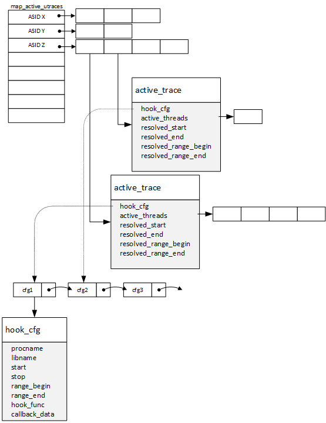
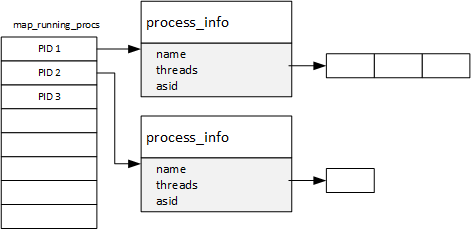
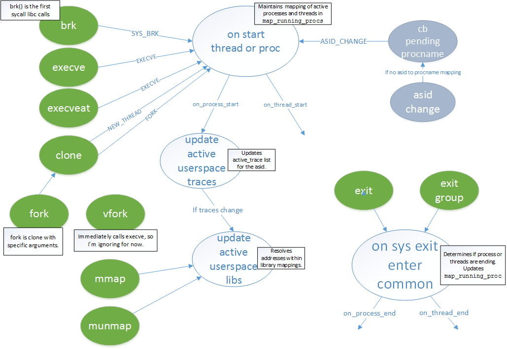
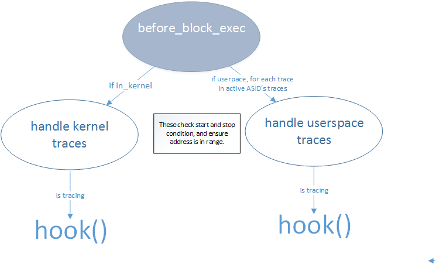

Plugin: hooks2
===========

Summary
-------

This plugin provides a mechanism to callback before executing code at a given
range of addresses for a specified program and/or library. Using `osi`, it
resolves program/library mappings when they are loaded.

Since the plugin needed to track when processes/threads start and stop, this
plugin also provides callbacks for these events.

This plugin by itself is not that useful. It is expected that you build upon it.
See `branchtrace` for example usage.

Future Ideas
------------

* [x] Provide mmap mappings.. Maybe a callback whenever they change.
* Add ability to filter on other callbacks (ie. `after_block_exec`)
* wildcard library and process names.
* [x] Currently hooks do not start until *trace_start* is executed. I need to
  add a mode where it starts immediately, so we can trace from when the
  program starts.
* Likewise for thread's starting.. It would be nice if we are actively tracing
  and a thread starts up, we could continue tracing the new thread. Maybe
  add a follow_threads option.
* [x] This currently only catches new threads/processes created after the plugin
  starts. We could use OSI's `on_get_processes` whenever the plugin is loaded to
  see what's currently running.
* [x] Use OSI's `on_get_proccesses` to ensure that we haven't missed a thread
  starting/stopping.
* ignore list of applications that we never want to trace.
* Lacks support for mips and ppc because of lack of OSI/syscalls support (I
  think).
* Add ability to hook function call. Possibly implemented but needs to be
  tested.

Issues
-----

* On a new thread, the syscall return value for `sys_clone()` occasionally
  is 0.
* ~~The process name returned by OSI (eg. get_current_process) is not the
  complete string. For example, `branchtest_multithreaded` is
  `branchtest_multi`. Is it limited to the first 16 characters?~~ This is a
  result from OSI using the `comm` member of task_struct which limited to 16
  bytes. I've made a change to OSI to optionally return `task_struct.mm.exe_file`
  which provides the full path. This plugin use exe_file if it's present;
  otherwise, it will default to `comm`.
* I've only used this against 1 re-hosted ARM firmware. It compiles for X86 and
  X64; however, I haven't verified that it works.
* Sometimes thread names are passed into on_process_start (example: "rs:main Q:Reg" from rsyslog)
* Very little testing has been performed on the ADD_HOOKS2_FUNCTION() call.
  It appears to work on ARM, but I haven't tried it on X86. Specifically,
  get_return_pc() needs to be looked at.

Arguments
---------

Dependencies
------------

* `osi` to get memory mappings, process names, and pids.
* `syscalls2` to track when applications/threads start and stop, and to track
  when memory maps change.


APIs and Callbacks
------------------

---

Name: **on\_process\_start**

Signature:

```C
void on_process_start(
    CPUState *cpu,
    const char *procname,
    target_ulong asid,
    target_pid_t pid);
```

Description:

---

Name: **on\_process\_end**

Signature:

```C
void on_process_end(
    CPUState *cpu,
    const char *procname,
    target_ulong asid,
    target_pid_t pid);
```

Description:

---

Name: **on\_thread\_start**

Signature:

```C
void on_thread_start(
    CPUState *cpu,
    const char *procname,
    target_ulong asid,
    target_pid_t pid,
    target_pid_t tid);
```

Description:

---

Name: **on\_thread\_end**

Signature:

```C
void on_thread_end(
    CPUState *cpu,
    const char *procname,
    target_ulong asid,
    target_pid_t pid,
    target_pid_t tid);
```

Description:

---

Name: **on\_mmap\_updated**

Signature:

```C
void on_mmap_updated(
    CPUState* cpu,
    const char *libname,
    target_ulong base,
    target_ulong size);
```

Description:

---

Name: ADD\_HOOKS2

Signature:

```C
typedef bool (*hooks2_func_t)(CPUState *, TranslationBlock *, void *);

int ADD_HOOKS2(
        hooks2_func_t hook,
        void *cb_data,
        bool is_kernel,
        const char *procname,
        const char *libname,
        target_ulong trace_start,
        target_ulong trace_stop,
        target_ulong range_begin,
        target_ulong range_end);
```

Description:

---

Name: ADD\_HOOKS2\_SINGLE\_INSN

Signature:

```C
int ADD_HOOKS2_SINGLE_INSN(
        hooks2_func_t hook,
        void *cb_data,
        const char *procname,
        const char *libname,
        target_ulong pc);
```

Description:

---

Name: ADD\_HOOKS2\_FUNCTION

Signature:

```C
int ADD_HOOKS2_FUNCTION(
    hooks2_func_t hook_enter,
    hooks2_func_t hook_return,
    void *cb_data,
    bool is_kernel,
    const char *procname,
    const char *libname,
    target_ulong offset);
```

Description:
---

Name: ENABLE\_HOOKS2

Signature:

```C
void ENABLE_HOOKS2(int id);
```

Description:

---

Name: DISABLE\_HOOKS2

Signature:

```C
void DISABLE_HOOKS2(int id);
```

Description:

Example
-------


Implementation Detail
------------------------






