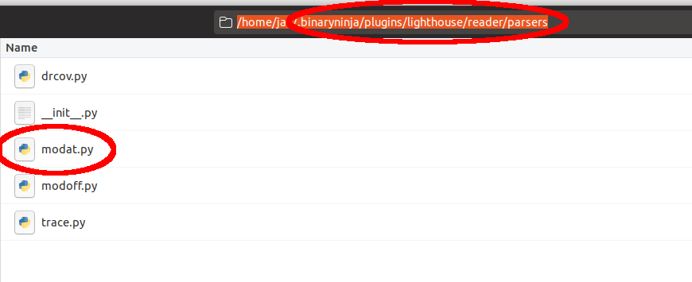
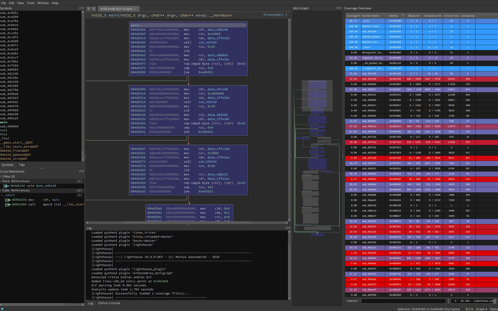

Summary
-------

This PANDA plugin emits a file, `lighthouse.out`, for usage by the lighthouse coverage plugin for IDA pro and Binary Ninja. This is especially useful for the analysis of binaries that have advanced anti-debug and anti-tracing features and are heavily obfuscated with overlapping code. Binary Ninja is capable of displaying this.


Arguments
---------

This plugin does not take any arguments, though a future improvement might be an argument to look for a particular module rather than covering everything and being able to specify the output file name.

Dependencies
------------

This module needs OSI.

Installation
------------

Binary Ninja:
The included file, `modat.py` needs to be placed into the lighthouse/reader/parsers directory. In the Binary Ninja plugin directory, there should be a file called `lighthouse_plugin.py` and a folder called `lighthouse`. Place `modat.py` there in the relative path `lighthouse/reader/parsers`



Example
-------

```$ ./panda-system-x86_64 -m 4096 -replay theRecording -os linux-64-ubuntu -panda osi -panda osi_linux:kconf_group=ubuntu:5.3.0-28-generic:64 -panda lighthouse_coverage```

produces a file in the current directory, `lighthouse.out', which contains coverage information lighthouse can use.



